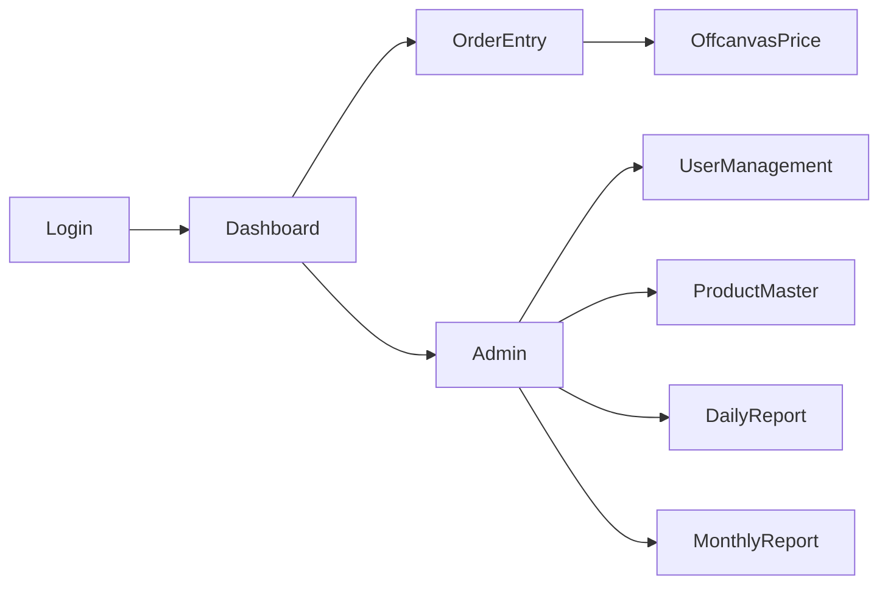

# UI/UXデザイン仕様書

| 版数 | 日付 | 作成者 | 変更内容 |
|------|------|--------|----------|
| 1.0 | 2025-08-09 | UI/UX設計担当 | 初版作成（受注フォーム・価格計算ドロワー・要望欄・管理画面を反映） |

## 1. デザインコンセプト
- **デザインビジョン**: 本社事務が迷わず素早く受注登録でき、管理者は最小操作で日次・月次運用とマスタ保守ができる業務特化UI。
- **ターゲットユーザー**: 本社事務（主要）、システム管理者（管理・保守）。PC/デスクトップ利用、マウス操作中心。
- **デザイン原則**: 一貫性（Bootstrap 5準拠）/ 可視性（状態が見える）/ 省手数（候補提示・自動補完）/ エラー予防（逐次バリデーション）。
- **デザインゴール**: 入力時間短縮、誤入力削減、視線移動とスクロール量の最小化。

## 2. デザインシステム
### 2.1 カラーパレット（Bootstrap準拠 + アクセント）
- プライマリ: #0d6efd（主要アクション/強調）
- セカンダリ: #6c757d（補助）
- サクセス: #198754 / ワーニング: #ffc107 / デンジャー: #dc3545 / インフォ: #0dcaf0
- 背景: #f8f9fa / サーフェス: #ffffff / ボーダー: #dee2e6 / テキスト: #212529
- コントラスト: 主要文言は 4.5:1 以上を担保（白/淡色背景 × 濃色テキスト）

### 2.2 タイポグラフィ
- フォント: System UI（Segoe UI, San Francisco 等）
- サイズ: H1 24–28 / H2 20–24 / Body 14–16 / Caption 12（px）
- 行間: 1.4–1.6。ラベルはフォーム要素と明確に関連付け。

### 2.3 スペーシング/レイアウト
- ベースユニット: 8px。フォーム内は16px、セクション間は24px以上。
- グリッド: 12カラム。3カラム（左統計/中央フォーム/右サイド機能）。

### 2.4 アイコン
- Bootstrap Icons。サイズ 16/20/24。アイコンのみボタンは aria-label を付与。

## 3. コンポーネント設計
- Button: Primary/Outline/Destructive（状態: default/hover/active/disabled/loading）
- Input/Select/Date/Time: エラーは直下に、必須はラベル横に赤アスタ。
- Offcanvas Drawer（右）: ヘッダー/ボディ/フッター（操作バー固定）。Escで閉じる、開閉はスライド。
- Table/List: ヘッダー固定、行ホバー、行末アクション（編集/削除/鍵/解除）。
- Toast/Alert: 送信成功はトースト、エラーは上部バナー + インライン。

## 4. レイアウト設計
- ヘッダー: 画面タイトル、ユーザー情報、ログアウト。
- 左サイドバー: 今日の統計/本日受電リスト。
- 中央: 受電→担当→契約者→確認者→商品→工事→その他（支払/チラシ/見積No/金額履歴/トリガー/備考/要望）。
- 右サイド: 担当検索 / 顧客抽出 / 価格計算の起動カード（本体はドロワー）。

## 5. 画面設計（主要）
### SCR-001: ログイン（`prototype/login.html`）
- 目的: 認証。ユーザーID/パスワード。Enter送信。失敗はバナー + フィールド強調。

### SCR-002: 受注入力（`prototype/index.html`）
- 目的: 受注登録。上から下へ入力順が自然になるよう配置。
- 重要UI:
  - 要望（備考とは別欄、任意、最大1000文字）。
  - 送信後の結果表示（受注/要望の二系統転記結果）。

### SCR-002A: 価格計算ドロワー（Offcanvas, `prototype/index.html`）
- 構成: カテゴリ → 商品名（カテゴリ連動） → 数量/単位（自動） → 基礎関連（高さ/長さの条件表示） → 値引き → 計算結果 → 「商品を追加」 → 選択商品（バスケット）。
- 挙動: カテゴリ変更で候補更新、基礎関連時のみオプション展開、即時計算、中央フォームへ反映。

### SCR-003: 管理者ダッシュボード（`prototype/admin.html`）
- サイドナビ: ダッシュボード/日報作成/月次集計/商品価格管理/販売担当者管理/トリガー管理/ユーザー管理/設定。
- ユーザー管理: 一覧/検索/新規追加モーダル/状態（有効・無効・ロック）/リセット/解除。フィルタは上部集約。

## 6. インタラクションデザイン
- バリデーション: 必須/形式/長さ。blur時と送信時に表示。複数エラーはセクション上部に集約も提示。
- フィードバック: 送信成功はトースト。Sheets送信失敗時は上部バナー + 「要望のみ再送」導線。
- ショートカット（提案）: Ctrl+Enter=送信、Esc=ドロワークローズ、/＝検索フォーカス。

## 7. アクセシビリティ仕様
- フォーカス順序: 左→中央→右→ドロワー。ドロワー表示中はフォーカストラップ。
- ARIA: アイコンボタンに aria-label、エラー文は aria-describedby で紐付け。
- キーボード: Tab/Shift+Tab/Enter/Space/Esc。リスト選択は矢印で移動可。
- コントラスト: ボタン/リンクは色 + 形状/下線で識別し 4.5:1 以上。

## 8. 画面遷移（概要）

## 9. コンポーネント仕様（抜粋）
- Offcanvas Price Drawer:
  - ヘッダー: タイトル/閉じる。
  - ボディ: 入力フォーム（カテゴリ→商品名→数量/単位→オプション→値引き）。
  - フッター: 「計算」「商品を追加」を固定（小画面操作性を担保）。
- 選択商品（バスケット）:
  - 行: 商品名/カテゴリ/数量・単位/基礎情報/値引き。
  - 行末: 削除（確認ダイアログ）。

## 10. メッセージ/トースト
- 受注送信: 「受注を送信しました。」
- 要望転記: 「要望を要望シートへ転記しました。」
- 一部失敗: 「受注は保存しましたが、要望の転記に失敗しました。再送してください。」

## 11. 品質/運用
- 一貫性: ラベル配置・必須表示・エラー表記を全画面で統一。
- ロギング: 送信/再送/削除/権限変更は監査対象。
- 国際化: 文言はキー管理で将来多言語化に対応。

## 12. 変更履歴
- 1.0（2025-08-09）: 初版。受注フォーム、価格計算ドロワー、要望分離転記、ユーザー管理UIを反映。

---

付録: 参考UI
- `prototype/index.html`: 受注入力・価格計算起動カード・オフキャンバス実装。
- `prototype/admin.html`: 管理者ナビ・ユーザー管理・設定。
- `prototype/login.html`: ログイン画面。
