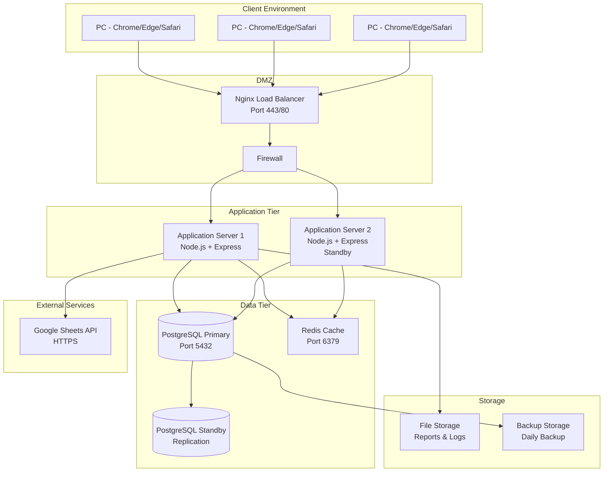
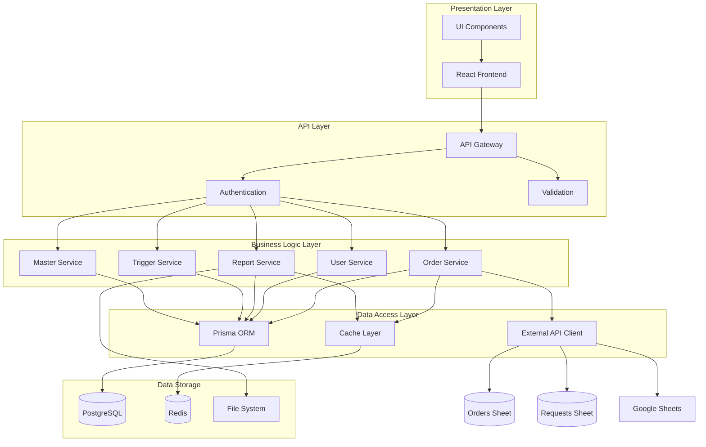
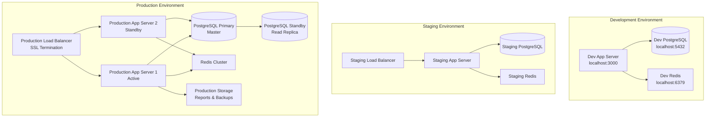
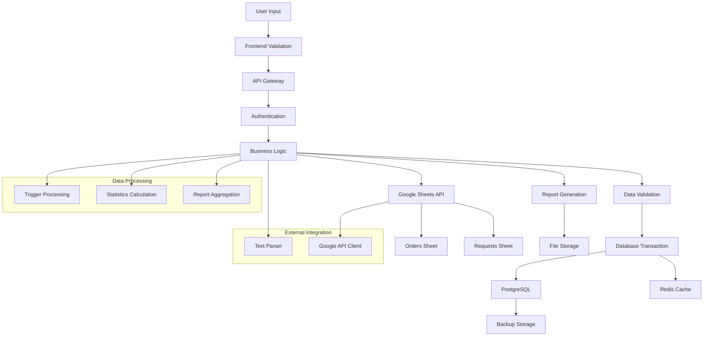
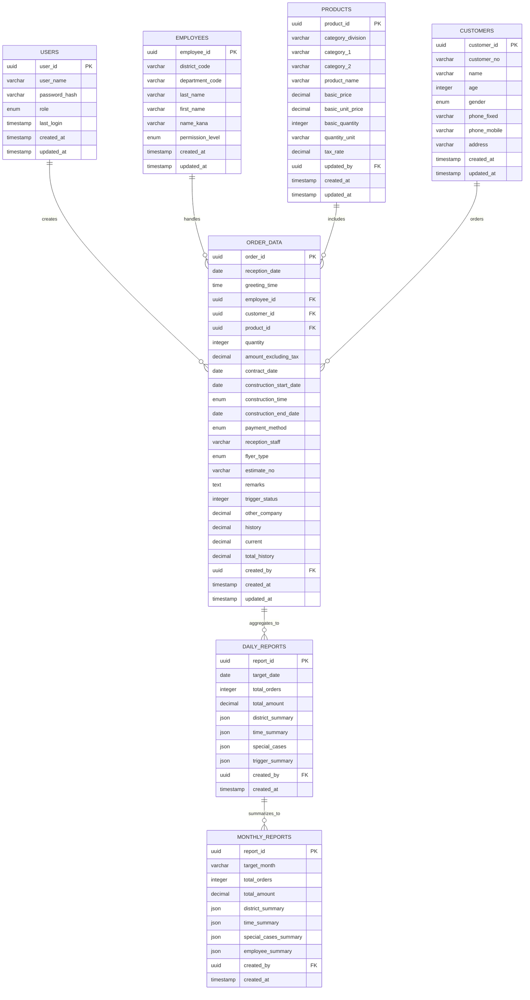
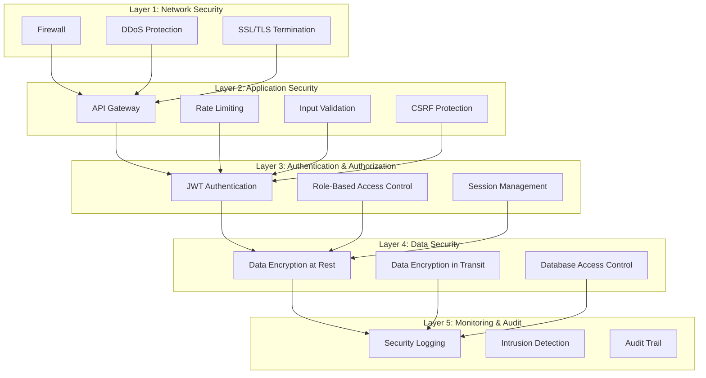
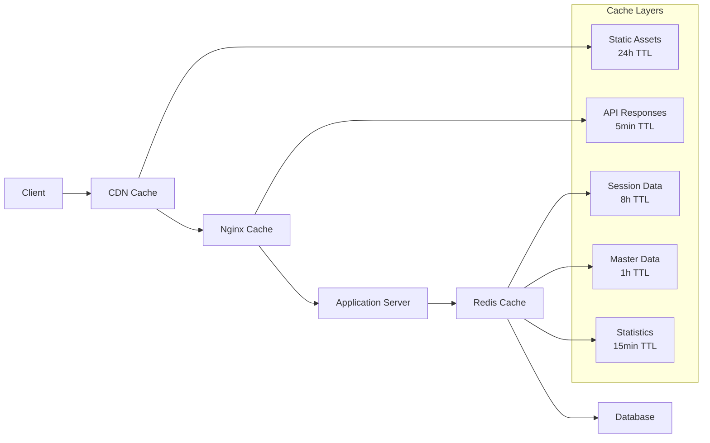
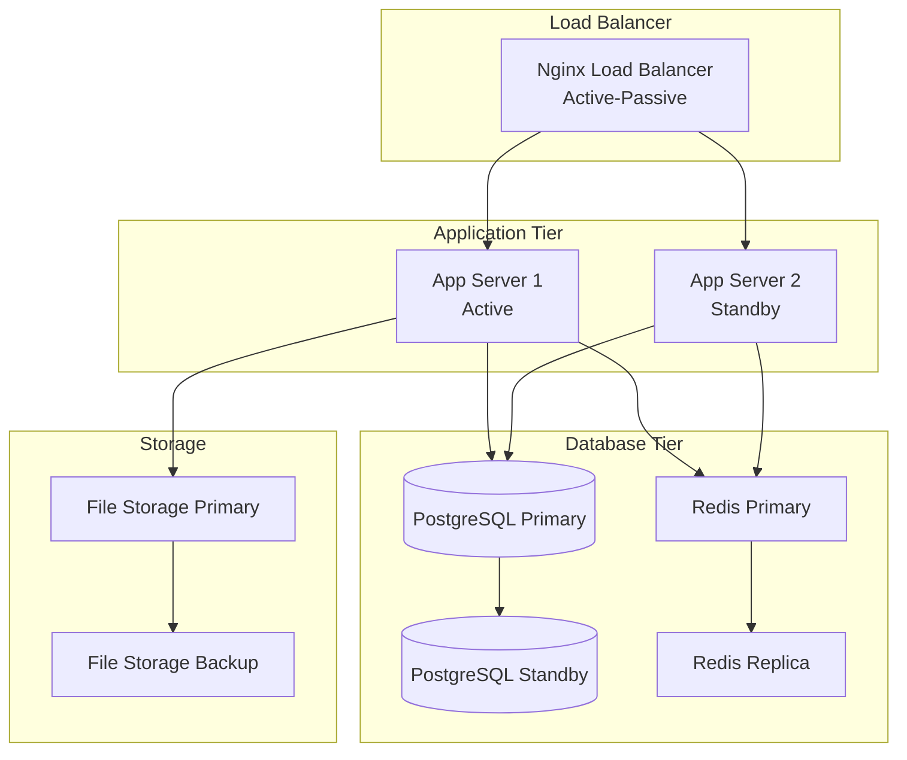
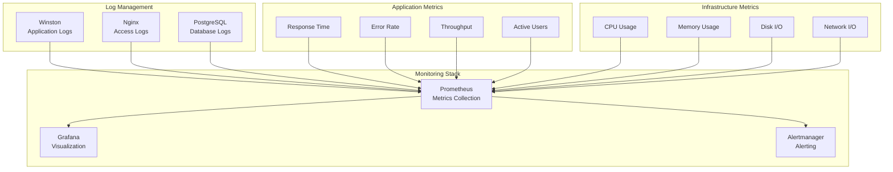
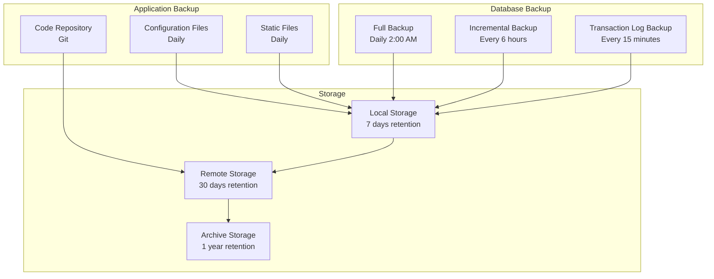

# システムアーキテクチャ設計書

## 1. アーキテクチャ概要

### 1.1 システム全体像
```mermaid
graph TB
    subgraph "Frontend Layer"
        A[Web Application<br/>React + TypeScript]
        B[Bootstrap UI Components]
    end
    
    subgraph "API Gateway Layer"
        C[API Gateway<br/>Express.js Router]
        D[Authentication Middleware]
        E[Rate Limiting]
    end
    
    subgraph "Application Layer"
        F[Order Entry Service\n(Orders + Requests Routing)]
        G[User Management Service]
        H[Report Generation Service]
        I[Trigger Management Service]
        J[Master Data Service]
    end
    
    subgraph "External Integration"
        K[Google Sheets API Client]
        K1[(Orders Sheet)]
        K2[(Requests Sheet)]
        L[Text Parser Service]
    end
    
    subgraph "Data Layer"
        M[(PostgreSQL Database)]
        N[Redis Cache]
    end
    
    subgraph "Infrastructure"
        O[Docker Containers]
        P[Nginx Reverse Proxy]
        Q[File Storage]
    end
    
    A --> C
    B --> A
    C --> D
    C --> E
    D --> F
    D --> G
    D --> H
    D --> I
    D --> J
    F --> K
    K --> K1
    K --> K2
    G --> L
    H --> M
    I --> M
    J --> M
    F --> M
    G --> M
    F --> N
    H --> N
    
    O --> P
    P --> C
    M --> Q
```

### 1.2 アーキテクチャパターン
- **レイヤードアーキテクチャ**: プレゼンテーション層、ビジネスロジック層、データアクセス層の3層構造
- **MVC パターン**: フロントエンドでのModel-View-Controller分離
- **RESTful API**: 標準的なHTTPメソッドとステータスコードを使用
- **マイクロサービス志向**: 機能ごとにサービスを分離し、将来の拡張性を確保

### 1.3 設計原則
- **単一責任原則**: 各コンポーネントは明確な責務を持つ
- **疎結合**: コンポーネント間の依存関係を最小化
- **高凝集**: 関連する機能を適切にグループ化
- **DRY原則**: コードの重複を避け、再利用性を向上
- **セキュリティ・バイ・デザイン**: 設計段階からセキュリティを組み込み

### 1.4 品質属性
1. **パフォーマンス**: レスポンス時間3秒以内、同時ユーザー15名対応
2. **可用性**: 営業時間中99.5%稼働率、4時間以内の障害復旧
3. **セキュリティ**: HTTPS暗号化、ユーザー認証・認可、監査ログ
4. **保守性**: モジュール化設計、テスト自動化、ドキュメント整備
5. **拡張性**: 50名まで拡張可能、新機能追加の容易性

### 1.5 技術的制約
- **開発言語**: JavaScript/TypeScript（フロントエンド）、Node.js（バックエンド）
- **データベース**: PostgreSQL（要件指定）
- **外部連携**: Google Sheets API必須
- **デバイス**: PC専用（Windows/Mac対応）
- **ブラウザ**: Chrome、Edge、Safari最新版

## 2. システム構成

### 2.1 物理構成図


### 2.2 論理構成図


### 2.3 デプロイメント図


### 2.4 ネットワーク構成
- **DMZ**: Nginx リバースプロキシ（SSL終端、負荷分散）
- **アプリケーション層**: プライベートネットワーク（10.0.1.0/24）
- **データベース層**: 分離されたプライベートネットワーク（10.0.2.0/24）
- **ファイアウォール**: ポート443（HTTPS）、80（HTTP リダイレクト）のみ外部公開
- **内部通信**: アプリケーション層からデータベース層への5432、6379ポート

## 3. 技術スタック

### 3.1 フロントエンド技術

#### 選定技術と根拠
| 技術分野 | 選定技術 | 選定理由 | 代替案 | トレードオフ |
|---------|---------|---------|--------|------------|
| フレームワーク | React 18 | 豊富なエコシステム、TypeScript対応、コンポーネント再利用性 | Vue.js 3, Angular 17 | 学習コスト vs 機能性 |
| 言語 | TypeScript 5.0 | 型安全性、開発効率、保守性向上 | JavaScript ES6+ | コンパイル時間 vs 品質向上 |
| 状態管理 | Zustand | 軽量、シンプル、TypeScript対応 | Redux Toolkit, Context API | 機能性 vs 複雑性 |
| UI フレームワーク | Bootstrap 5.3 | 要件指定、豊富なコンポーネント、レスポンシブ対応 | Material-UI, Tailwind CSS | カスタマイズ性 vs 開発速度 |
| ビルドツール | Vite 5.0 | 高速ビルド、HMR、モダンな設定 | Create React App, Webpack | 設定の柔軟性 vs シンプルさ |
| HTTP クライアント | Axios | インターセプター、エラーハンドリング、TypeScript対応 | Fetch API, SWR | 機能性 vs バンドルサイズ |
| フォームライブラリ | React Hook Form | 高性能、バリデーション、TypeScript対応 | Formik, 自作 | 学習コスト vs 機能性 |
| 日付処理 | date-fns | 軽量、Tree-shaking対応、関数型 | Moment.js, Day.js | バンドルサイズ vs 機能性 |

### 3.2 バックエンド技術

#### 選定技術と根拠
| 技術分野 | 選定技術 | 選定理由 | 代替案 | トレードオフ |
|---------|---------|---------|--------|------------|
| ランタイム | Node.js 20 LTS | 要件指定、JavaScript統一、豊富なエコシステム | Python, Java, Go | 型安全性 vs 開発効率 |
| フレームワーク | Express.js 4.18 | 軽量、柔軟性、豊富なミドルウェア | Fastify, Koa, NestJS | パフォーマンス vs 学習コスト |
| 言語 | TypeScript 5.0 | 型安全性、開発効率、エラー削減 | JavaScript ES6+ | コンパイル時間 vs 品質向上 |
| ORM | Prisma 5.0 | TypeScript対応、マイグレーション、型安全 | TypeORM, Sequelize | 学習コスト vs 開発効率 |
| 認証 | JWT + bcrypt | ステートレス、スケーラブル、標準的 | Passport.js, Auth0 | セキュリティ vs 複雑性 |
| バリデーション | Zod | TypeScript対応、スキーマ定義、型推論 | Joi, Yup | 学習コスト vs 型安全性 |
| ログ | Winston | 構造化ログ、複数出力、レベル制御 | Pino, console.log | パフォーマンス vs 機能性 |
| テスト | Jest + Supertest | 豊富な機能、モック、カバレッジ | Mocha + Chai, Vitest | 設定の複雑さ vs 機能性 |

### 3.3 データベース

#### 選定技術と根拠
| 技術分野 | 選定技術 | 選定理由 | 代替案 | トレードオフ |
|---------|---------|---------|--------|------------|
| RDBMS | PostgreSQL 15 | 要件指定、ACID準拠、JSON対応、拡張性 | MySQL 8.0, SQLite | 複雑性 vs 機能性 |
| キャッシュ | Redis 7.0 | 高速、永続化、データ構造対応 | Memcached, In-Memory | メモリ使用量 vs 機能性 |
| 接続プール | Prisma Client | 自動接続管理、型安全、最適化 | pg-pool, node-postgres | 学習コスト vs 開発効率 |
| マイグレーション | Prisma Migrate | スキーマ管理、バージョン管理、型生成 | Knex.js, 手動SQL | 柔軟性 vs 安全性 |

### 3.4 インフラ・運用

#### 選定技術と根拠
| 技術分野 | 選定技術 | 選定理由 | 代替案 | トレードオフ |
|---------|---------|---------|--------|------------|
| コンテナ | Docker | 環境統一、デプロイ簡素化、スケーラビリティ | VM、ベアメタル | リソース使用量 vs 運用効率 |
| オーケストレーション | Docker Compose | シンプル、開発・本番統一、小規模適用 | Kubernetes, Docker Swarm | 複雑性 vs 機能性 |
| リバースプロキシ | Nginx | 高性能、SSL終端、静的ファイル配信 | Apache, Traefik | 設定の複雑さ vs パフォーマンス |
| プロセス管理 | PM2 | プロセス監視、自動再起動、ログ管理 | Forever, Systemd | 機能性 vs シンプルさ |
| 監視 | Prometheus + Grafana | メトリクス収集、可視化、アラート | Datadog, New Relic | コスト vs 機能性 |
| ログ管理 | ELK Stack (Lite) | ログ集約、検索、可視化 | Fluentd, Splunk | 複雑性 vs 機能性 |

## 4. コンポーネント設計

### 4.1 コンポーネント一覧

| コンポーネントID | コンポーネント名 | 責務 | 技術スタック |
|-----------------|----------------|------|-------------|
| COMP-FE-001 | Order Entry Form | 受注入力UI | React + TypeScript |
| COMP-FE-002 | Dashboard | 統計表示・管理機能UI | React + Chart.js |
| COMP-FE-003 | Authentication | 認証UI | React + React Router |
| COMP-BE-001 | Order Service | 受注データ処理 | Express + Prisma |
| COMP-BE-002 | User Service | ユーザー管理 | Express + JWT |
| COMP-BE-003 | Report Service | レポート生成 | Express + PDF-lib |
| COMP-BE-004 | Trigger Service | トリガー管理 | Express + Cron |
| COMP-BE-005 | Master Service | マスタデータ管理 | Express + Prisma |
| COMP-EX-001 | Google Sheets Client | Sheets API連携 | Google APIs |
| COMP-EX-002 | Text Parser | 顧客情報抽出 | Custom Parser |

### 4.2 コンポーネント詳細

#### COMP-FE-001: Order Entry Form
- **責務**: 受注入力フォームのUI提供、バリデーション、データ送信
- **インターフェース**: 
  - 入力: ユーザー入力データ、マスタデータ
  - 出力: 受注データ、バリデーションエラー
- **依存関係**: Order Service API、Master Service API
- **実装方針**: React Hook Form + Zod バリデーション、コンポーネント分割
- **技術選定根拠**: 高性能フォーム処理、型安全性、再利用性

#### COMP-FE-002: Dashboard
- **責務**: 統計情報表示、管理機能UI、リアルタイム更新
- **インターフェース**: 
  - 入力: 統計データ、フィルター条件
  - 出力: グラフ・チャート、テーブル表示
- **依存関係**: Report Service API、Order Service API
- **実装方針**: Chart.js によるグラフ描画、WebSocket によるリアルタイム更新
- **技術選定根拠**: 豊富なチャート種類、カスタマイズ性、パフォーマンス

#### COMP-BE-001: Order Service
- **責務**: 受注データのCRUD操作、ビジネスロジック処理、外部連携
- **インターフェース**: 
  - 入力: HTTP リクエスト（JSON）
  - 出力: HTTP レスポンス（JSON）、Google Sheets データ（Orders Sheet／Requests Sheet）
- **依存関係**: PostgreSQL、Redis、Google Sheets API
- **実装方針**: RESTful API、トランザクション管理、エラーハンドリング
- **技術選定根拠**: スケーラビリティ、保守性、テスタビリティ

#### COMP-BE-003: Report Service
- **責務**: 日報・月次レポート生成、CSV/PDF出力、集計処理
- **インターフェース**: 
  - 入力: 集計条件、出力形式指定
  - 出力: レポートファイル（CSV/PDF）、集計データ
- **依存関係**: PostgreSQL、File Storage
- **実装方針**: 非同期処理、テンプレートエンジン、ファイル管理
- **技術選定根拠**: 大量データ処理、メモリ効率、出力品質

#### COMP-BE-004: Trigger Service
- **責務**: トリガー条件判定、自動設定、状態管理
- **インターフェース**: 
  - 入力: 受注データ、トリガー条件
  - 出力: トリガー状態、アラート通知
- **依存関係**: PostgreSQL、Order Service
- **実装方針**: ルールエンジン、イベント駆動処理、状態遷移管理
- **技術選定根拠**: 柔軟なルール定義、拡張性、保守性

## 5. データアーキテクチャ

### 5.1 データフロー図


### 5.2 データストア設計

#### PostgreSQL データベース設計


#### Redis キャッシュ設計
- **セッション管理**: `session:{user_id}` - ユーザーセッション情報
- **統計データ**: `stats:daily:{date}` - 日次統計キャッシュ
- **マスタデータ**: `master:products` - 商品マスタキャッシュ
- **API レスポンス**: `api:response:{hash}` - APIレスポンスキャッシュ
- **レート制限**: `rate_limit:{user_id}` - API呼び出し制限

#### データ構造詳細

##### 商品マスタ（PRODUCTS）テーブル設計
| カラム名 | データ型 | 制約 | 説明 |
|---------|---------|------|------|
| product_id | UUID | PK | 商品ID（主キー） |
| category_division | VARCHAR(20) | NOT NULL | 区分（大分類） |
| category_1 | VARCHAR(50) | NOT NULL | カテゴリ1（中分類） |
| category_2 | VARCHAR(50) | NULL | カテゴリ2（小分類） |
| product_name | VARCHAR(200) | NOT NULL | 商品名 |
| basic_price | DECIMAL(10,2) | NOT NULL | 基本価格 |
| basic_unit_price | DECIMAL(10,2) | NOT NULL | 基本超単価 |
| basic_quantity | INTEGER | NOT NULL | 基本数量 |
| quantity_unit | VARCHAR(10) | NOT NULL | 数量単位（個、m、㎡等） |
| tax_rate | DECIMAL(5,3) | NOT NULL DEFAULT 0.10 | 税率 |
| updated_by | UUID | FK | 更新者ID |
| created_at | TIMESTAMP | NOT NULL | 作成日時 |
| updated_at | TIMESTAMP | NOT NULL | 更新日時 |

##### 社員マスタ（EMPLOYEES）テーブル設計
| カラム名 | データ型 | 制約 | 説明 |
|---------|---------|------|------|
| employee_id | UUID | PK | 社員ID（主キー） |
| district_code | VARCHAR(10) | NOT NULL | 地区コード |
| department_code | VARCHAR(10) | NOT NULL | 所属コード |
| last_name | VARCHAR(50) | NOT NULL | 担当名（苗字） |
| first_name | VARCHAR(50) | NOT NULL | 担当名（名前） |
| name_kana | VARCHAR(100) | NOT NULL | 担当名（カナ） |
| permission_level | ENUM | NOT NULL | 権限レベル（office, admin） |
| created_at | TIMESTAMP | NOT NULL | 作成日時 |
| updated_at | TIMESTAMP | NOT NULL | 更新日時 |

##### インデックス設計
**商品マスタ用インデックス:**
- `idx_products_category` - (category_division, category_1, category_2)
- `idx_products_name` - (product_name)
- `idx_products_updated` - (updated_at)

**社員マスタ用インデックス:**
- `idx_employees_district` - (district_code)
- `idx_employees_department` - (department_code)
- `idx_employees_name_kana` - (name_kana)
- `idx_employees_codes` - (district_code, department_code)

##### API エンドポイント設計

**商品マスタ関連API:**
```typescript
// 商品検索API
GET /api/products/search
Query Parameters:
  - category_division?: string
  - category_1?: string  
  - category_2?: string
  - product_name?: string (部分一致)
  - limit?: number (デフォルト: 50)
  - offset?: number (デフォルト: 0)

Response:
{
  "products": [
    {
      "product_id": "uuid",
      "category_division": "工事",
      "category_1": "外壁",
      "category_2": "塗装",
      "product_name": "外壁塗装工事",
      "basic_price": 100000,
      "basic_unit_price": 5000,
      "basic_quantity": 10,
      "quantity_unit": "㎡",
      "tax_rate": 0.10
    }
  ],
  "total": 150,
  "has_more": true
}

// 価格計算API
POST /api/products/calculate-price
Request Body:
{
  "product_id": "uuid",
  "quantity": 15
}

Response:
{
  "basic_amount": 100000,      // 基本価格（基本数量分）
  "excess_amount": 25000,      // 超過分（5㎡ × 5000円）
  "subtotal": 125000,          // 税抜合計
  "tax_amount": 12500,         // 消費税額
  "total": 137500,             // 税込合計
  "calculation_detail": {
    "basic_quantity": 10,
    "excess_quantity": 5,
    "unit_price": 5000,
    "tax_rate": 0.10
  }
}
```

**社員マスタ関連API:**
```typescript
// 担当者検索API
GET /api/employees/search
Query Parameters:
  - name_kana?: string (部分一致)
  - district_code?: string
  - department_code?: string
  - limit?: number (デフォルト: 20)

Response:
{
  "employees": [
    {
      "employee_id": "uuid",
      "district_code": "01",
      "department_code": "A01",
      "last_name": "田中",
      "first_name": "太郎",
      "name_kana": "タナカタロウ",
      "full_name": "田中 太郎"
    }
  ],
  "total": 15
}
```

**受注・要望転記API（Google Sheets 連携）:**
```typescript
// 受注データ転記 API（Orders Sheet）
POST /api/orders/sheets
Body:
{
  order: { /* 受注データ一式 */ },
  staff: { district_code: string; department_code: string; display_name: string }
}
Response: { success: boolean }

// 要望データ転記 API（Requests Sheet）
POST /api/requests/sheets
Body:
{
  request_text: string,
  staff: { district_code: string; department_code: string; display_name: string },
  created_at?: string
}
Response: { success: boolean }
```

### 5.3 データ統合

#### ETL プロセス
1. **Extract**: 日次バッチで受注データを抽出
2. **Transform**: 
   - データクレンジング（重複除去、形式統一）
   - 集計処理（地区別、時間別、トリガー別）
   - ビジネスルール適用（トリガー判定、特殊案件分類）
3. **Load**: 
   - 日報データテーブルへの格納
   - 統計データのキャッシュ更新
   - Google Sheets への同期

#### データ同期戦略
- **リアルタイム同期**: 受注データ → Google Sheets（即座）
- **バッチ同期**: 統計データ → Redis キャッシュ（1時間毎）
- **レポート生成**: 日報・月次レポート（日次・月次バッチ）

### 5.4 データガバナンス

#### データ品質管理
- **入力検証**: Zod スキーマによる型チェック
- **一意性制約**: データベース制約による重複防止
- **参照整合性**: 外部キー制約による整合性保証
- **データ監査**: 全操作の監査ログ記録

#### プライバシー・セキュリティ
- **個人情報保護**: 顧客データの暗号化（AES-256）
- **アクセス制御**: ロールベースアクセス制御（RBAC）
- **データ保持**: 3年経過後の自動アーカイブ
- **バックアップ**: 日次フルバックアップ + 差分バックアップ

### 5.5 データ分散戦略

#### レプリケーション
- **PostgreSQL**: マスター・スレーブ構成
- **Redis**: レプリケーション + センチネル構成
- **読み取り分散**: レポート処理は読み取り専用レプリカから実行

#### パーティショニング
- **受注データ**: 月別パーティショニング（パフォーマンス向上）
- **ログデータ**: 日別パーティショニング（管理効率化）

## 6. セキュリティアーキテクチャ

### 6.1 セキュリティ層

#### 多層防御戦略


### 6.2 認証・認可

#### JWT ベース認証
```typescript
interface JWTPayload {
  userId: string;
  role: 'office' | 'admin';
  permissions: string[];
  iat: number;
  exp: number;
}
```

#### ロールベースアクセス制御（RBAC）
- **本社事務（office）**: 受注入力、統計閲覧
- **システム管理者（admin）**: 全機能アクセス、ユーザー管理、レポート生成

#### セッション管理
- **セッション有効期限**: 8時間（営業時間内）
- **自動ログアウト**: 6060分間非アクティブ
- **同時ログイン制限**: 1セッション/ユーザー

### 6.3 データ保護

#### 暗号化戦略
- **通信暗号化**: TLS 1.3（HTTPS）
- **保存時暗号化**: AES-256-GCM
- **パスワードハッシュ化**: bcrypt（コスト係数12）
- **データベース暗号化**: PostgreSQL Transparent Data Encryption

#### 機密データ管理
- **環境変数**: Docker Secrets による管理
- **API キー**: HashiCorp Vault による管理
- **証明書**: 自動更新（Let's Encrypt）

### 6.4 脅威対策

#### OWASP Top 10 対策
1. **Injection**: Prisma ORM によるパラメータ化クエリ
2. **Broken Authentication**: JWT + bcrypt + レート制限
3. **Sensitive Data Exposure**: データ暗号化 + HTTPS
4. **XML External Entities**: JSON のみ使用
5. **Broken Access Control**: RBAC + API レベル認可
6. **Security Misconfiguration**: セキュリティヘッダー設定
7. **Cross-Site Scripting**: React の自動エスケープ + CSP
8. **Insecure Deserialization**: JSON のみ使用
9. **Known Vulnerabilities**: 依存関係の自動スキャン
10. **Insufficient Logging**: 包括的な監査ログ

#### セキュリティ監視
- **侵入検知**: 異常なアクセスパターンの検出
- **ログ監視**: リアルタイムログ分析
- **脆弱性スキャン**: 定期的な自動スキャン

## 7. 非機能要件への対応

### 7.1 パフォーマンス対策

#### キャッシュ戦略


#### データベース最適化
- **インデックス戦略**: 
  - 受注データ: `(reception_date, employee_id)`
  - 顧客データ: `(customer_no, phone_mobile)`
  - トリガー管理: `(trigger_status, created_at)`
- **クエリ最適化**: Prisma クエリの最適化、N+1問題の解決
- **接続プール**: 最大20接続、アイドルタイムアウト30秒

#### 負荷分散
- **アプリケーションサーバー**: Nginx による負荷分散
- **データベース**: 読み取り専用レプリカへの負荷分散
- **静的ファイル**: CDN による配信

### 7.2 可用性対策

#### 冗長化戦略


#### 障害対策
- **ヘルスチェック**: アプリケーション・データベースの死活監視
- **自動フェイルオーバー**: 30秒以内の自動切り替え
- **サーキットブレーカー**: 外部API呼び出しの保護
- **グレースフルシャットダウン**: 処理中リクエストの完了待機

#### バックアップ戦略
- **データベース**: 日次フルバックアップ + 6時間毎差分バックアップ
- **ファイル**: 日次バックアップ + 3世代保持
- **設定ファイル**: Git による版数管理
- **復旧時間目標（RTO）**: 4時間以内
- **復旧ポイント目標（RPO）**: 6時間以内

### 7.3 拡張性対策

#### 水平スケーリング
- **アプリケーション**: Docker コンテナによる水平拡張
- **データベース**: 読み取り専用レプリカの追加
- **キャッシュ**: Redis クラスター構成への移行
- **ロードバランサー**: 複数インスタンス対応

#### 垂直スケーリング
- **CPU/メモリ**: 動的リソース調整
- **ストレージ**: 自動拡張設定
- **データベース**: インスタンスサイズ調整

#### アーキテクチャ進化
- **マイクロサービス化**: 機能別サービス分離
- **イベント駆動**: 非同期処理の導入
- **API Gateway**: 統一エントリーポイント

## 8. 技術選定根拠

### 8.1 フロントエンド技術選定理由

#### React 選定理由
**選定根拠:**
- 豊富なエコシステムと長期サポート
- TypeScript との優れた統合
- コンポーネントベース開発による再利用性
- 大規模アプリケーションでの実績

**代替案との比較:**
- **Vue.js**: 学習コストは低いが、エコシステムが React より小さい
- **Angular**: エンタープライズ向けだが、小規模チームには過剰

**トレードオフ:**
- 学習コスト vs 長期的な開発効率
- バンドルサイズ vs 機能性

#### TypeScript 選定理由
**選定根拠:**
- 型安全性によるバグの早期発見
- IDEサポートによる開発効率向上
- 大規模開発での保守性向上
- チーム開発での品質統一

### 8.2 バックエンド技術選定理由

#### Node.js + Express 選定理由
**選定根拠:**
- 要件で指定されたJavaScript/TypeScript
- フロントエンドとの言語統一
- 豊富なライブラリエコシステム
- 非同期処理に適している

**代替案との比較:**
- **Fastify**: 高性能だが、エコシステムが小さい
- **NestJS**: エンタープライズ向けだが、学習コストが高い

#### Prisma 選定理由
**選定根拠:**
- TypeScript ネイティブサポート
- 型安全なデータベースアクセス
- 自動マイグレーション機能
- 優れた開発体験

### 8.3 データベース選定理由

#### PostgreSQL 選定理由
**選定根拠:**
- 要件で指定
- ACID準拠の信頼性
- JSON データ型サポート
- 豊富な拡張機能

#### Redis 選定理由
**選定根拠:**
- 高速なインメモリキャッシュ
- 豊富なデータ構造
- 永続化機能
- セッション管理に適している

### 8.4 インフラ選定理由

#### Docker 選定理由
**選定根拠:**
- 環境の統一と再現性
- デプロイの簡素化
- スケーラビリティ
- 開発・本番環境の一致

#### Nginx 選定理由
**選定根拠:**
- 高性能なリバースプロキシ
- SSL終端機能
- 静的ファイル配信の最適化
- 豊富な設定オプション

## 9. 運用・保守

### 9.1 監視戦略

#### システム監視


#### 監視項目
- **アプリケーション**: レスポンス時間、エラー率、スループット
- **データベース**: 接続数、クエリ実行時間、デッドロック
- **インフラ**: CPU、メモリ、ディスク、ネットワーク使用率
- **ビジネス**: 日次受注件数、トリガー発生率、ユーザー活動

#### アラート設定
- **緊急（P1）**: システムダウン、データベース接続不可
- **重要（P2）**: レスポンス時間5秒超過、エラー率5%超過
- **警告（P3）**: リソース使用率80%超過、外部API失敗

### 9.2 ログ管理

#### ログレベル戦略
- **ERROR**: システムエラー、例外、障害
- **WARN**: 警告、パフォーマンス劣化、リトライ
- **INFO**: 業務イベント、API呼び出し、認証
- **DEBUG**: 詳細なトレース情報（開発環境のみ）

#### ログ形式（JSON構造化ログ）
```json
{
  "timestamp": "2025-08-07T16:30:23.123Z",
  "level": "INFO",
  "service": "order-service",
  "traceId": "abc123",
  "userId": "user123",
  "action": "create_order",
  "message": "Order created successfully",
  "metadata": {
    "orderId": "ord123",
    "amount": 10000
  }
}
```

#### ログ保持ポリシー
- **アプリケーションログ**: 30日間
- **アクセスログ**: 90日間
- **監査ログ**: 3年間（法的要件）
- **エラーログ**: 1年間

### 9.3 バックアップ戦略

#### バックアップ種類


#### 復旧手順
1. **障害検知**: 監視システムによる自動検知
2. **影響範囲確認**: ログ分析、ユーザー影響調査
3. **復旧作業**: バックアップからの復元、設定修正
4. **動作確認**: 機能テスト、データ整合性確認
5. **サービス再開**: 段階的なサービス復旧

### 9.4 災害復旧計画

#### 復旧目標
- **RTO（Recovery Time Objective）**: 4時間
- **RPO（Recovery Point Objective）**: 6時間
- **最大許容停止時間**: 営業時間内4時間

#### DR サイト構成
- **データレプリケーション**: リアルタイム同期
- **アプリケーション**: 待機系環境の常時稼働
- **ネットワーク**: DNS切り替えによる自動フェイルオーバー

## 10. リスク分析と対策

### 10.1 技術的リスク

#### 高リスク項目
| リスク項目 | 影響度 | 発生確率 | 対策 |
|-----------|--------|----------|------|
| Google API制限 | 高 | 中 | API使用量監視、代替手段準備、エラーハンドリング |
| データベース障害 | 高 | 低 | レプリケーション、自動バックアップ、監視強化 |
| Node.js脆弱性 | 中 | 中 | 定期アップデート、脆弱性スキャン、依存関係管理 |
| メモリリーク | 中 | 低 | メモリ監視、定期再起動、コードレビュー |

#### 対策詳細
**Google API制限対策:**
- 使用量の監視とアラート設定
- バッチ処理による効率化
- フォールバック機能の実装
- 複数APIキーによる負荷分散

### 10.2 運用リスク

#### 中リスク項目
| リスク項目 | 影響度 | 発生確率 | 対策 |
|-----------|--------|----------|------|
| 運用者のスキル不足 | 中 | 中 | 運用マニュアル整備、研修実施、外部サポート |
| バックアップ失敗 | 高 | 低 | バックアップ監視、テスト復元、冗長化 |
| 設定ミス | 中 | 中 | 設定管理ツール、変更管理プロセス、テスト環境 |
| 容量不足 | 中 | 中 | 使用量監視、自動拡張、容量計画 |

### 10.3 セキュリティリスク

#### セキュリティ脅威マトリックス
| 脅威 | 影響度 | 発生確率 | 対策 |
|------|--------|----------|------|
| 不正アクセス | 高 | 中 | 多要素認証、アクセス制御、監視強化 |
| SQLインジェクション | 高 | 低 | ORM使用、入力検証、コードレビュー |
| XSS攻撃 | 中 | 低 | 自動エスケープ、CSP設定、入力検証 |
| DDoS攻撃 | 中 | 中 | レート制限、WAF、CDN |

### 10.4 リスク軽減策

#### 予防策
- **定期的なセキュリティ監査**
- **依存関係の自動スキャン**
- **コードレビューの徹底**
- **テスト自動化の推進**

#### 検知策
- **リアルタイム監視**
- **異常検知アラート**
- **ログ分析**
- **パフォーマンス監視**

#### 対応策
- **インシデント対応手順**
- **エスカレーション体制**
- **復旧作業手順**
- **事後分析プロセス**

## 11. 付録

### 11.1 用語集

| 用語 | 定義 |
|------|------|
| API Gateway | APIの統一エントリーポイント、認証・認可・レート制限を提供 |
| ORM | Object-Relational Mapping、オブジェクトとリレーショナルデータベースのマッピング |
| JWT | JSON Web Token、認証情報を含むトークン形式 |
| RBAC | Role-Based Access Control、ロールベースアクセス制御 |
| ETL | Extract Transform Load、データ抽出・変換・格納処理 |
| CDN | Content Delivery Network、コンテンツ配信ネットワーク |
| WAF | Web Application Firewall、Webアプリケーション用ファイアウォール |
| CSP | Content Security Policy、コンテンツセキュリティポリシー |

### 11.2 参考資料

#### 技術ドキュメント
- [React 18 Documentation](https://react.dev/)
- [Node.js Best Practices](https://github.com/goldbergyoni/nodebestpractices)
- [PostgreSQL Documentation](https://www.postgresql.org/docs/)
- [Prisma Documentation](https://www.prisma.io/docs/)
- [Google Sheets API Documentation](https://developers.google.com/sheets/api)

#### セキュリティガイドライン
- [OWASP Top 10](https://owasp.org/www-project-top-ten/)
- [Node.js Security Checklist](https://blog.risingstack.com/node-js-security-checklist/)
- [PostgreSQL Security](https://www.postgresql.org/docs/current/security.html)

#### 運用ベストプラクティス
- [The Twelve-Factor App](https://12factor.net/)
- [Site Reliability Engineering](https://sre.google/books/)
- [Docker Best Practices](https://docs.docker.com/develop/dev-best-practices/)

### 11.3 変更履歴

| 版数 | 日付 | 変更内容 | 作成者 |
|------|------|----------|--------|
| 1.0 | 2025-08-07 | 初版作成 | システムアーキテクト |
| 1.1 | 2025-08-07 | 商品マスタ・社員マスタのデータ構造詳細化、API仕様追加 | システムアーキテクト |
| 1.2 | 2025-08-08 | Google Sheets 連携の2系統化（Orders Sheet/Requests Sheet）を反映<br/>・全体図・論理図・データフロー図を更新<br/>・Order Serviceの出力仕様を更新<br/>・Sheets連携APIドラフトを追記 | システムアーキテクト |

---

**注意事項:**
- 本設計書は要件定義書 v1.1 に基づいて作成されています
- 技術選定は2025年8月時点の情報に基づいています
- 実装時には最新の技術動向とセキュリティ情報を確認してください
- 本番環境への適用前には十分な検証とテストを実施してください
