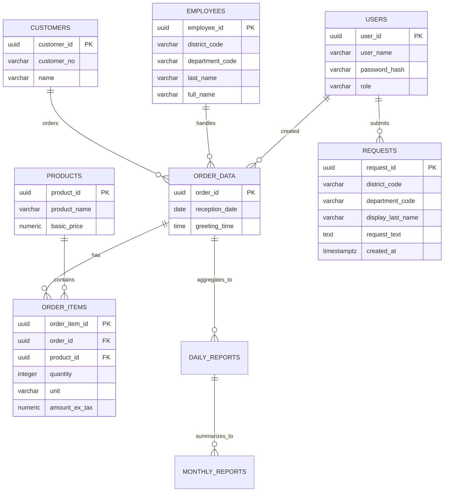

# データモデル設計書

| 版数 | 日付 | 作成者 | 変更内容 |
|------|------|--------|----------|
| 1.0 | 2025-08-09 | データ設計担当 | 初版作成（要望データ・二系統Sheets転記を反映） |
| 1.1 | 2025-08-14 | データ設計担当 | データ辞書を補強（必須/型/例を明確化）、EMPLOYEES索引方針の明確化 |

## 1. 概要
- 対象システム: 受注入力フォームシステム
- 参照資料: `docs/要件定義.md` v2.4, `docs/システムアーキテクチャ設計書.md` v1.2
- 目的: 概念/論理/物理レベルのデータ設計を定義し、実装と運用の基盤を提供
- スコープ: 業務DB（PostgreSQL）と外部連携（Google Sheets: Orders/Requests）

## 2. 命名・型・共通規約
- **命名規約**: テーブル/列ともに `snake_case`、主キーは `*_id (uuid)`
- **監査列**: `created_at timestamptz not null`, `updated_at timestamptz not null`
- **金額型**: `numeric(12,2)`、率は `numeric(5,3)`
- **真偽値**: `boolean`、JSON構造は `jsonb`
- **文字列**: 原則 `varchar(…)`、可変大は `text`

## 3. 概念ER図（概略）

## 4. 論理データモデル（テーブル定義）
### 4.1 USERS（ユーザー情報）
- 用途: ログイン/権限管理
- 主キー: `user_id`
- 列
  - `user_id uuid not null`
  - `user_name varchar(100) not null`（氏名）
  - `login_id varchar(100) unique not null`
  - `password_hash varchar(255) not null`
  - `role varchar(16) not null`（'office'|'admin'）
  - `account_state varchar(16) not null default 'active'`（'active'|'inactive'|'locked'）
  - `password_expires_on date null`
  - `login_fail_count int not null default 0`
  - `locked_at timestamptz null`
  - `security_settings jsonb not null default '{}'`
  - `last_login_at timestamptz null`
  - `created_at timestamptz not null`
  - `updated_at timestamptz not null`
- インデックス
  - `ux_users_login_id (login_id)`
  - `ix_users_last_login (last_login_at)`

### 4.2 EMPLOYEES（社員マスタ：販売担当者）
- 主キー: `employee_id`
- 列
  - `employee_id uuid not null`
  - `district_code varchar(3) not null`（511/521/531/541/561）
  - `department_code varchar(10) not null`
  - `department_name varchar(50) not null`
  - `full_name varchar(50) not null`
  - `display_last_name varchar(30) not null`（転記用：苗字）
  - `search_kana varchar(50) not null`（全角・スペースなし）
  - `employee_type varchar(8) not null default 'regular'`（'regular'|'se'）
  - `permission_level smallint not null default 0`
  - `created_at timestamptz not null`
  - `updated_at timestamptz not null`
- インデックス
  - `ix_emp_district (district_code)`
  - `ix_emp_dept (department_code)`
  - `ix_emp_kana (search_kana)`
  - `ix_emp_codes (district_code, department_code)`

### 4.3 PRODUCTS（商品価格マスタ：拡張）
- 主キー: `product_id`
- 列
  - `product_id uuid not null`
  - `category_division varchar(20) not null`
  - `category_1 varchar(50) not null`
  - `category_2 varchar(50) null`
  - `product_name varchar(200) not null`
  - `basic_price numeric(12,2) not null`
  - `basic_unit_price numeric(12,2) not null`
  - `basic_quantity int not null`
  - `quantity_unit varchar(10) not null`（㎡/m/個/式）
  - `tax_rate numeric(5,3) not null default 0.100`
  - `discount_conditions jsonb null`
  - `discount_price numeric(12,2) null`
  - `discount2_conditions jsonb null`
  - `discount2_price numeric(12,2) null`
  - `height_based_pricing jsonb null`（基礎用）
  - `basic_length int null`（基礎用：既定長さ）
  - `is_active boolean not null default true`
  - `effective_date date not null`
  - `expiry_date date null`
  - `created_at timestamptz not null`
  - `updated_at timestamptz not null`
- インデックス
  - `ix_products_cat (category_division, category_1, category_2)`
  - `ix_products_name (product_name)`
  - `ix_products_active (is_active, effective_date, expiry_date)`

### 4.4 CUSTOMERS（顧客マスタ）
- 主キー: `customer_id`
- 列
  - `customer_id uuid not null`
  - `customer_no varchar(30) not null`
  - `name varchar(50) not null`
  - `age int null`
  - `gender varchar(8) null`（'male'|'female'|'other'）
  - `phone_fixed varchar(20) null`
  - `phone_mobile varchar(20) null`
  - `address varchar(200) null`
  - `created_at timestamptz not null`
  - `updated_at timestamptz not null`
- インデックス
  - `ix_cust_no (customer_no)`
  - `ix_cust_phone (phone_mobile)`

### 4.5 ORDER_DATA（受注データ：ヘッダ）
- 主キー: `order_id`
- 外部キー: `employee_id -> EMPLOYEES`, `customer_id -> CUSTOMERS`, `created_by -> USERS`
- 列
  - `order_id uuid not null`
  - `reception_date date not null`
  - `greeting_time time null`
  - `employee_id uuid not null`
  - `customer_id uuid null`
  - `contract_date date null`
  - `construction_start_date date null`
  - `construction_time varchar(8) null`（午前/午後/夜間）
  - `construction_end_date date null`
  - `payment_method varchar(16) null`
  - `reception_staff varchar(50) null`
  - `flyer_type varchar(16) null`
  - `estimate_no varchar(30) null`
  - `other_company numeric(12,2) null`
  - `history numeric(12,2) null`
  - `current numeric(12,2) null`
  - `total_history numeric(12,2) null`
  - `trigger_status int null`（1/2/4/5/空）
  - `remarks text null`
  - `created_by uuid not null`
  - `created_at timestamptz not null`
  - `updated_at timestamptz not null`
- インデックス
  - `ix_order_reception (reception_date)`
  - `ix_order_employee (employee_id, reception_date)`

### 4.6 ORDER_ITEMS（受注明細）
- 主キー: `order_item_id`
- 外部キー: `order_id -> ORDER_DATA`, `product_id -> PRODUCTS`
- 列
  - `order_item_id uuid not null`
  - `order_id uuid not null`
  - `product_id uuid not null`
  - `quantity int not null`
  - `unit varchar(10) not null`
  - `amount_ex_tax numeric(12,2) not null`
  - `discount_value numeric(12,2) null`（%は別管理、保存時は適用後金額）
  - `note varchar(200) null`
  - `created_at timestamptz not null`
  - `updated_at timestamptz not null`
- インデックス
  - `ix_order_items_order (order_id)`

### 4.7 REQUESTS（要望データ：別シート転記対象）
- 用途: フォームの「要望」を受注とは別系統で管理
- 主キー: `request_id`
- 列
  - `request_id uuid not null`
  - `district_code varchar(3) not null`
  - `department_code varchar(10) not null`
  - `display_last_name varchar(30) not null`（転記用苗字）
  - `request_text text not null`
  - `created_by uuid null`（USERS: 任意）
  - `created_at timestamptz not null`
  - `updated_at timestamptz not null`
- インデックス
  - `ix_requests_created (created_at)`
  - `ix_requests_codes (district_code, department_code)`

### 4.8 DAILY_REPORTS / MONTHLY_REPORTS（集計）
- DAILY_REPORTS
  - `report_id uuid pk`, `target_date date not null`, `total_orders int`, `total_amount numeric(12,2)`,
    `district_summary jsonb`, `time_summary jsonb`, `special_cases jsonb`, `trigger_summary jsonb`,
    `created_by uuid not null`, `created_at timestamptz not null`
- MONTHLY_REPORTS
  - `report_id uuid pk`, `target_month varchar(7) not null`（YYYY-MM）, `total_orders int`, `total_amount numeric(12,2)`,
    `district_summary jsonb`, `time_summary jsonb`, `special_cases_summary jsonb`, `employee_summary jsonb`,
    `created_by uuid not null`, `created_at timestamptz not null`

## 5. 外部連携（Google Sheets）
### 5.1 Orders Sheet マッピング（アプリ → Sheets）
- 列順（推奨）: 
  - `timestamp, reception_date, greeting_time, staff_display_name, staff_district_code, staff_department_code, customer_name, customer_age, phone_fixed, phone_mobile, product_name, quantity, unit, amount_ex_tax, contract_date, start_date, time_slot, end_date, payment_method, reception_staff, flyer, estimate_no, other_company, history, current, total_history, trigger, remarks`
- 変換
  - `staff_display_name` = EMPLOYEES.display_last_name
  - 金額/数値は文字列化（カンマ無）

### 5.2 Requests Sheet マッピング（アプリ → Sheets）
- 列順（固定）: `timestamp, staff_district_code, staff_department_code, staff_display_name, request_text`
- 送信条件: 要望欄が空でない場合のみ

## 6. 制約・参照整合性
- 外部キーは `on update cascade`、`on delete restrict`（受注ヘッダ削除には業務承認が必要）
- 循環参照は設計しない
- 参照データ（EMPLOYEES/PRODUCTS）は is_active と有効期間で参照可否を制御

## 7. インデックス/性能方針
- 受注日・担当者別検索に対応する複合索引（`(employee_id, reception_date)`）
- 商品検索（カテゴリ/商品名）にカテゴリ・名称索引
- 要望は日付/地区・所属の索引で抽出を高速化

## 8. データ品質/バリデーション
- 必須チェック: 要件定義の必須項目に準拠
- 形式チェック: 電話番号・コードは半角、カナは全角・スペースなし（EMPLOYEES.search_kana）
- 値域: 年齢は `0..120`、税率は `0..1`

## 9. マイグレーション・初期データ
- マイグレーションツール（例）: Prisma Migrate / SQLスクリプト
- 初期投入: EMPLOYEES/PRODUCTS マスタ（実データ準拠のCSV）

## 10. 変更履歴
- 1.0（2025-08-09）: 初版。要望データエンティティ、Sheets二系統マッピング、受注明細（ORDER_ITEMS）を定義

---

### 付録A. データ辞書（主要項目）
- Orders Sheet
  - `timestamp` (ISO8601文字列): 送信日時。例: `2025-08-09T10:15:24.000Z`
  - `reception_date` (YYYY-MM-DD): 受電受付日。例: `2025-08-09`
  - `greeting_time` (HH:MM): 挨拶時間。例: `10:30`
  - `staff_display_name` (文字列): 転記用苗字。例: `田中`
  - `staff_district_code` (文字列3桁): 地区コード。例: `511`
  - `staff_department_code` (文字列): 所属コード。例: `7`
  - `customer_name` (文字列): 契約者名
  - `customer_age` (整数): 契約者年齢（0..120）
  - `phone_fixed`/`phone_mobile` (文字列): 電話番号（半角）
  - `product_name` (文字列): 商品名
  - `quantity` (数値): 数量（1以上）
  - `unit` (文字列): 単位（㎡/m/式 等）
  - `amount_ex_tax` (数値): 金額（税抜・小数なし）
  - `time_slot` (文字列): 午前/午後/夜間
  - `remarks` (文字列): 備考
- Requests Sheet
  - `timestamp` (ISO8601文字列): 送信日時
  - `staff_district_code` (文字列3桁)
  - `staff_department_code` (文字列)
  - `staff_display_name` (文字列): 転記用苗字
  - `request_text` (文字列 最大1000): 要望

#### 付録A.1 EMPLOYEES（社員マスタ）補足データ辞書
- `district_code` (varchar(3), 必須): 地区コード（例: `511`）。Sheets/検索APIの主要フィルタ
- `department_code` (varchar(10), 必須): 所属コード（例: `7`/`A01`）
- `display_last_name` (varchar(30), 必須): 転記用苗字（例: `田中`）
- `search_kana` (varchar(50), 必須): 全角カナ・スペースなし（例: `ﾀﾅｶ` ではなく `タナカ`）
- 索引方針: `ix_emp_codes (district_code, department_code)` を主軸に、`ix_emp_kana (search_kana)` で前方一致検索を高速化

### 付録B. コード/列の正規化方針
- 地区コード（EMPLOYEES.district_code）: 文字列3桁固定、将来の非数値コードに備えて `varchar`
- 所属コード（EMPLOYEES.department_code）: 可変長、数値/文字混在許容
- 税率（PRODUCTS.tax_rate）: 例 `0.100`。UI表示は10%
