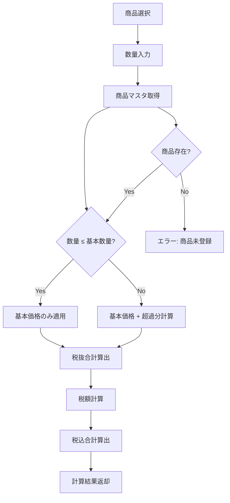

# 価格計算ロジック設計書

## 1. 概要

### 1.1 目的
受注入力フォームシステムにおける価格計算機能の詳細なロジックを定義し、正確で一貫性のある価格計算を実現する。

### 1.2 適用範囲
- REQ-F-004: 価格計算機能
- 商品価格マスタとの連携
- 受注入力フォームでの価格自動計算
- 税計算および表示

### 1.3 前提条件
- 商品価格マスタが適切に設定されている
- 商品には区分・カテゴリ・基本価格・基本超単価・基本数量・数量単位が定義されている
- 税率は商品ごとに設定可能（デフォルト10%）

## 2. データ構造

### 2.1 商品価格マスタ構造
```typescript
interface Product {
  product_id: string;           // 商品ID
  category_division: string;    // 区分（工事、商品、サービス等）
  category_1: string;          // カテゴリ1（大分類）
  category_2: string | null;   // カテゴリ2（小分類）
  product_name: string;        // 商品名
  basic_price: number;         // 基本価格（基本数量までの固定価格）
  basic_unit_price: number;    // 基本超単価（基本数量を超えた場合の単価）
  basic_quantity: number;      // 基本数量（基本価格が適用される数量）
  quantity_unit: string;      // 数量単位（㎡、m、個、式等）
  tax_rate: number;           // 税率（0.08, 0.10等）
  is_active: boolean;         // 有効フラグ
  effective_date: Date;       // 有効開始日
  expiry_date: Date | null;   // 有効終了日
}
```

### 2.2 拡張商品価格マスタ構造（条件付き割引対応）
```typescript
interface ExtendedProduct extends Product {
  // 条件付き割引設定
  discount_conditions?: DiscountCondition[];
  discount_price?: number;           // 割引適用時の価格
  discount2_conditions?: DiscountCondition[];
  discount2_price?: number;          // 第2条件割引価格
  
  // 高さ別価格設定（基礎商品用）
  height_based_pricing?: {
    [height: string]: {
      basic_price: number;           // 基本価格
      length_addition: number;       // 長さ加算単価
    };
  };
  basic_length?: number;             // 基本長さ（基礎商品用）
}

interface DiscountCondition {
  type: 'category' | 'item' | 'contains';
  value?: string;                    // カテゴリ名または商品名
  values?: string[];                 // 複数の商品名（contains用）
}
```

### 2.3 価格計算結果構造
```typescript
interface PriceCalculationResult {
  product_id: string;
  product_name: string;
  display_name: string;              // 表示用商品名（値引き表示含む）
  quantity: number;
  quantity_unit: string;
  
  // 基本価格計算
  basic_quantity_applied: number;    // 基本価格適用数量
  basic_amount: number;              // 基本価格分の金額
  
  // 超過分計算
  excess_quantity: number;           // 超過数量
  excess_unit_price: number;         // 超過分単価
  excess_amount: number;             // 超過分金額
  
  // 値引き計算
  discount_type: 'percentage' | 'fixed' | 'conditional' | 'none';
  discount_value: number;            // 値引き値（%または金額）
  discount_amount: number;           // 値引き金額
  discount_reason?: string;          // 値引き理由（条件付き割引の場合）
  
  // 合計金額
  subtotal_before_discount: number;  // 値引き前税抜合計
  subtotal_before_tax: number;       // 税抜合計
  tax_rate: number;                  // 適用税率
  tax_amount: number;                // 税額
  total_amount: number;              // 税込合計
  
  // 計算詳細
  calculation_breakdown: CalculationBreakdown;
  
  // メタ情報
  calculated_at: Date;
  calculation_method: 'standard' | 'conditional' | 'manual_override';
  related_products?: string[];       // 関連商品ID（条件付き割引用）
}

interface CalculationBreakdown {
  basic_calculation: {
    description: string;    // "基本価格 × 1式"
    quantity: number;
    unit_price: number;
    amount: number;
  };
  excess_calculation?: {
    description: string;    // "超過分 5㎡ × 5,000円/㎡"
    quantity: number;
    unit_price: number;
    amount: number;
  };
  discount_calculation?: {
    description: string;    // "値引き 10%" または "条件割引 消毒商品との組み合わせ"
    type: 'percentage' | 'fixed' | 'conditional';
    value: number;
    amount: number;
    reason?: string;
  };
  tax_calculation: {
    description: string;    // "消費税 10%"
    tax_rate: number;
    taxable_amount: number;
    tax_amount: number;
  };
}
```

### 2.4 複数商品管理構造
```typescript
interface SelectedProductsManager {
  products: SelectedProduct[];
  management_fee: {
    enabled: boolean;
    amount: number;           // 一般管理費（デフォルト20,000円）
  };
  set_discounts: SetDiscount[];
  total_summary: {
    subtotal_before_tax: number;
    total_tax: number;
    total_amount: number;
  };
}

interface SelectedProduct {
  product_id: string;
  category: string;
  item: string;
  display_name: string;       // 表示用商品名
  quantity: number;
  discount_value: number;
  discount_text: string;      // "10%" または "5,000円"
  price_ex_tax: number;
  price_in_tax: number;
  calculation_result: PriceCalculationResult;
}

interface SetDiscount {
  name: string;               // "外基礎・中基礎セット値引き"
  amount: number;             // 40,000円
  applicable_products: string[]; // 対象商品ID
  condition_met: boolean;
}
```

## 3. 価格計算ロジック

### 3.1 基本計算フロー


### 3.2 詳細計算ロジック

#### 3.2.1 基本価格計算
```typescript
function calculateBasicAmount(product: Product, quantity: number): number {
  // 基本数量以下の場合は基本価格をそのまま適用
  if (quantity <= product.basic_quantity) {
    return product.basic_price;
  }
  
  // 基本数量を超える場合も基本価格は必ず適用
  return product.basic_price;
}
```

#### 3.2.2 超過分計算
```typescript
function calculateExcessAmount(product: Product, quantity: number): {
  excess_quantity: number;
  excess_amount: number;
} {
  if (quantity <= product.basic_quantity) {
    return { excess_quantity: 0, excess_amount: 0 };
  }
  
  const excess_quantity = quantity - product.basic_quantity;
  const excess_amount = excess_quantity * product.basic_unit_price;
  
  return { excess_quantity, excess_amount };
}
```

#### 3.2.3 値引き計算
```typescript
function calculateDiscount(price: number, discountValue: number): number {
  if (!discountValue || discountValue <= 0) return 0;
  
  // 100未満の場合はパーセント値引き
  if (discountValue < 100) {
    return Math.floor(price * (discountValue / 100));
  }
  
  // 100以上の場合は固定金額値引き（価格を超えない）
  return Math.min(discountValue, price);
}
```

#### 3.2.4 条件付き割引計算
```typescript
function calculateConditionalDiscount(
  product: ExtendedProduct, 
  quantity: number, 
  selectedProducts: SelectedProduct[]
): {
  applied_price: number;
  discount_reason?: string;
} {
  let appliedPrice = product.basic_unit_price || product.basic_price;
  let discountReason: string | undefined;
  
  // 第1条件チェック（優先度高）
  if (product.discount_conditions) {
    const hasFirstCondition = checkDiscountConditions(
      product.discount_conditions, 
      selectedProducts
    );
    
    if (hasFirstCondition && product.discount_price) {
      appliedPrice = product.discount_price;
      discountReason = "条件割引適用";
      return { applied_price: appliedPrice * quantity, discount_reason: discountReason };
    }
  }
  
  // 第2条件チェック
  if (product.discount2_conditions) {
    const hasSecondCondition = checkDiscountConditions(
      product.discount2_conditions, 
      selectedProducts
    );
    
    if (hasSecondCondition && product.discount2_price) {
      appliedPrice = product.discount2_price;
      discountReason = "第2条件割引適用";
      return { applied_price: appliedPrice * quantity, discount_reason: discountReason };
    }
  }
  
  // 条件に該当しない場合は通常価格
  return { applied_price: appliedPrice * quantity };
}

function checkDiscountConditions(
  conditions: DiscountCondition[], 
  selectedProducts: SelectedProduct[]
): boolean {
  return conditions.some(condition => {
    switch (condition.type) {
      case 'category':
        return selectedProducts.some(p => p.category === condition.value);
      case 'item':
        return selectedProducts.some(p => p.item === condition.value);
      case 'contains':
        return selectedProducts.some(p => 
          condition.values?.some(value => p.item.includes(value))
        );
      default:
        return false;
    }
  });
}
```

#### 3.2.5 基礎商品の高さ別価格計算
```typescript
function calculateKisoPrice(
  product: ExtendedProduct, 
  height: string, 
  length: number
): number {
  if (!product.height_based_pricing || !product.height_based_pricing[height]) {
    throw new Error(`高さ ${height}cm の価格設定が見つかりません`);
  }
  
  const heightData = product.height_based_pricing[height];
  const basicLength = product.basic_length || 20;
  
  let totalPrice = heightData.basic_price;
  
  // 基本長さを超える場合は加算
  if (length > basicLength) {
    const extraLength = length - basicLength;
    totalPrice += extraLength * heightData.length_addition;
  }
  
  return totalPrice;
}
```

#### 3.2.6 税額計算
```typescript
function calculateTax(subtotal: number, tax_rate: number): number {
  // 消費税は小数点以下切り捨て
  return Math.floor(subtotal * tax_rate);
}
```

#### 3.2.4 総合価格計算
```typescript
function calculatePrice(product: Product, quantity: number): PriceCalculationResult {
  // 入力検証
  if (quantity <= 0) {
    throw new Error('数量は1以上である必要があります');
  }
  
  if (!product.is_active) {
    throw new Error('この商品は現在利用できません');
  }
  
  // 有効期限チェック
  const now = new Date();
  if (product.effective_date > now || 
      (product.expiry_date && product.expiry_date < now)) {
    throw new Error('この商品は有効期限外です');
  }
  
  // 基本価格計算
  const basic_amount = calculateBasicAmount(product, quantity);
  const basic_quantity_applied = Math.min(quantity, product.basic_quantity);
  
  // 超過分計算
  const { excess_quantity, excess_amount } = calculateExcessAmount(product, quantity);
  
  // 税抜合計
  const subtotal_before_tax = basic_amount + excess_amount;
  
  // 税額計算
  const tax_amount = calculateTax(subtotal_before_tax, product.tax_rate);
  
  // 税込合計
  const total_amount = subtotal_before_tax + tax_amount;
  
  // 計算詳細の生成
  const calculation_breakdown: CalculationBreakdown = {
    basic_calculation: {
      description: `基本価格 ${basic_quantity_applied}${product.quantity_unit}`,
      quantity: basic_quantity_applied,
      unit_price: product.basic_price,
      amount: basic_amount
    },
    tax_calculation: {
      description: `消費税 ${(product.tax_rate * 100).toFixed(1)}%`,
      tax_rate: product.tax_rate,
      taxable_amount: subtotal_before_tax,
      tax_amount: tax_amount
    }
  };
  
  // 超過分がある場合は詳細に追加
  if (excess_quantity > 0) {
    calculation_breakdown.excess_calculation = {
      description: `超過分 ${excess_quantity}${product.quantity_unit} × ${product.basic_unit_price.toLocaleString()}円/${product.quantity_unit}`,
      quantity: excess_quantity,
      unit_price: product.basic_unit_price,
      amount: excess_amount
    };
  }
  
  return {
    product_id: product.product_id,
    product_name: product.product_name,
    quantity,
    quantity_unit: product.quantity_unit,
    basic_quantity_applied,
    basic_amount,
    excess_quantity,
    excess_unit_price: product.basic_unit_price,
    excess_amount,
    subtotal_before_tax,
    tax_rate: product.tax_rate,
    tax_amount,
    total_amount,
    calculation_breakdown,
    calculated_at: new Date(),
    calculation_method: 'standard'
  };
}
```

### 3.3 複数商品管理ロジック

#### 3.3.1 商品選択・追加機能
```typescript
class ProductManager {
  private selectedProducts: SelectedProduct[] = [];
  private maxProducts = 6;           // 通常商品最大数
  private maxKisoProducts = 4;       // 基礎商品最大数
  
  addProduct(product: SelectedProduct): boolean {
    // 既存商品の更新または新規追加
    const existingIndex = this.selectedProducts.findIndex(
      p => p.product_id === product.product_id
    );
    
    if (existingIndex !== -1) {
      this.selectedProducts[existingIndex] = product;
    } else {
      // 最大数チェック
      const currentCount = this.selectedProducts.filter(
        p => p.product_id.includes('kiso-') === product.product_id.includes('kiso-')
      ).length;
      
      const maxCount = product.product_id.includes('kiso-') ? 
        this.maxKisoProducts : this.maxProducts;
      
      if (currentCount >= maxCount) {
        return false; // 追加失敗
      }
      
      this.selectedProducts.push(product);
    }
    
    this.updateSummary();
    return true;
  }
  
  removeProduct(productId: string): void {
    this.selectedProducts = this.selectedProducts.filter(
      p => p.product_id !== productId
    );
    this.updateSummary();
  }
  
  getSelectedProducts(): SelectedProduct[] {
    return this.selectedProducts.filter(p => p.price_ex_tax > 0);
  }
}
```

#### 3.3.2 商品名表示ロジック
```typescript
function generateDisplayName(product: SelectedProduct): string {
  let displayName = '';
  
  if (product.product_id.includes('kiso-')) {
    // 基礎商品の場合
    const fullName = product.item;
    
    if (fullName.includes('クラック')) {
      // クラック商品: "外クラック", "中片クラック", "中両面クラック"
      const match = fullName.match(/(外クラック|中片クラック|中両面クラック)/);
      displayName = match ? match[0] : fullName.split(' ')[0];
    } else {
      // 基礎商品: "外基礎", "中基礎"
      const match = fullName.match(/(外基礎|中基礎)/);
      if (match) {
        displayName = match[0];
        // 追加工事の場合は「追」を追加
        if (product.category === '追加工事') {
          displayName += '追';
        }
      } else {
        displayName = fullName;
      }
    }
  } else {
    // 通常商品の場合
    displayName = product.item;
  }
  
  // 値引きがある場合は▲値引き額を追加
  if (product.discount_value && product.discount_value > 0) {
    if (product.discount_value < 100) {
      displayName += `▲${product.discount_value}%`;
    } else {
      displayName += `▲${formatNumber(product.discount_value)}円`;
    }
  }
  
  return displayName;
}
```

#### 3.3.3 セット割引判定
```typescript
function checkSetDiscounts(selectedProducts: SelectedProduct[]): SetDiscount[] {
  const setDiscounts: SetDiscount[] = [];
  
  // 基礎セット割引チェック（外基礎 + 中基礎）
  const hasGaiKiso = selectedProducts.some(p => 
    p.category === "新規工事" && p.item.includes("外基礎")
  );
  const hasNakaKiso = selectedProducts.some(p => 
    p.category === "新規工事" && p.item.includes("中基礎")
  );
  
  if (hasGaiKiso && hasNakaKiso) {
    setDiscounts.push({
      name: "外基礎・中基礎セット値引き",
      amount: 40000,
      applicable_products: selectedProducts
        .filter(p => p.item.includes("基礎"))
        .map(p => p.product_id),
      condition_met: true
    });
  }
  
  return setDiscounts;
}
```

#### 3.3.4 合計金額計算
```typescript
function calculateTotalSummary(
  selectedProducts: SelectedProduct[],
  managementFee: { enabled: boolean; amount: number },
  setDiscounts: SetDiscount[]
): {
  subtotal_before_tax: number;
  management_fee_amount: number;
  set_discount_amount: number;
  total_tax: number;
  total_amount: number;
} {
  const validProducts = selectedProducts.filter(p => p.price_ex_tax > 0);
  
  // 商品合計（税抜）
  let subtotal_before_tax = validProducts.reduce(
    (sum, product) => sum + product.price_ex_tax, 0
  );
  
  // 一般管理費
  const management_fee_amount = managementFee.enabled ? managementFee.amount : 0;
  subtotal_before_tax += management_fee_amount;
  
  // セット割引
  const set_discount_amount = setDiscounts
    .filter(discount => discount.condition_met)
    .reduce((sum, discount) => sum + discount.amount, 0);
  subtotal_before_tax -= set_discount_amount;
  
  // 消費税計算
  const total_tax = Math.floor(subtotal_before_tax * 0.1);
  
  // 税込合計
  const total_amount = subtotal_before_tax + total_tax;
  
  return {
    subtotal_before_tax,
    management_fee_amount,
    set_discount_amount,
    total_tax,
    total_amount
  };
}
```

## 4. 計算パターン例

### 4.1 パターン1: 基本数量以下の場合
**商品**: 外壁塗装工事
- 基本価格: 100,000円
- 基本数量: 10㎡
- 基本超単価: 5,000円/㎡
- 税率: 10%

**注文数量**: 8㎡

**計算結果**:
```
基本価格: 100,000円（8㎡ ≤ 10㎡のため基本価格適用）
超過分: 0円
税抜合計: 100,000円
消費税: 10,000円
税込合計: 110,000円
```

### 4.2 パターン2: 基本数量を超える場合
**商品**: 外壁塗装工事（同上）

**注文数量**: 15㎡

**計算結果**:
```
基本価格: 100,000円（10㎡分）
超過分: 25,000円（5㎡ × 5,000円/㎡）
税抜合計: 125,000円
消費税: 12,500円
税込合計: 137,500円
```

### 4.3 パターン3: 商品・サービス系（基本数量1の場合）
**商品**: 設計料
- 基本価格: 50,000円
- 基本数量: 1式
- 基本超単価: 50,000円/式
- 税率: 10%

**注文数量**: 2式

**計算結果**:
```
基本価格: 50,000円（1式分）
超過分: 50,000円（1式 × 50,000円/式）
税抜合計: 100,000円
消費税: 10,000円
税込合計: 110,000円
```

### 4.4 パターン4: 条件付き割引（カビ商品）
**商品**: カビ処理
- 基本価格: 2,500円/㎡
- 条件割引1: 消毒商品との組み合わせ → 1,000円/㎡
- 条件割引2: 基礎商品またはDC2/60商品との組み合わせ → 1,700円/㎡

**注文数量**: 10㎡
**選択済み商品**: 消毒・再処理

**計算結果**:
```
基本価格: 25,000円（10㎡ × 2,500円/㎡）
条件割引適用: 10,000円（10㎡ × 1,000円/㎡） ※消毒商品との組み合わせ
税抜合計: 10,000円
消費税: 1,000円
税込合計: 11,000円
```

### 4.5 パターン5: 基礎商品（高さ別価格）
**商品**: 外基礎
- 高さ: 40cm
- 基本価格: 540,000円（基本長さ20mまで）
- 長さ加算: 7,000円/m
- 値引き: 5%

**施工長さ**: 25m

**計算結果**:
```
基本価格: 540,000円（20m分）
超過分: 35,000円（5m × 7,000円/m）
小計: 575,000円
値引き: 28,750円（5%）
税抜合計: 546,250円
消費税: 54,625円
税込合計: 600,875円
表示名: "外基礎▲5%"
```

### 4.6 パターン6: 複数商品 + セット割引
**選択商品**:
1. 外基礎 40cm 25m: 546,250円（値引き後）
2. 中基礎 30cm 15m: 420,000円
3. 一般管理費: 20,000円

**セット割引**: 外基礎・中基礎セット値引き 40,000円

**計算結果**:
```
商品合計: 966,250円
一般管理費: 20,000円
小計: 986,250円
セット割引: -40,000円
税抜合計: 946,250円
消費税: 94,625円
税込合計: 1,040,875円
```

### 4.7 パターン7: 値引き計算（パーセントと固定金額）
**値引き例**:
- 10% → 10万円の商品なら10,000円値引き
- 5,000円 → 固定5,000円値引き（商品価格が5,000円未満の場合は商品価格まで）
- 150% → 100未満ではないため、150円の固定金額値引きとして処理

## 5. エラーハンドリング

### 5.1 エラーパターン
| エラーコード | エラー内容 | 対処法 |
|------------|-----------|--------|
| CALC_001 | 商品が見つからない | 商品マスタの確認、商品選択の再実行 |
| CALC_002 | 数量が不正（0以下） | 正の数値での再入力 |
| CALC_003 | 商品が無効状態 | 有効な商品の選択 |
| CALC_004 | 有効期限外 | 有効期限内の商品の選択 |
| CALC_005 | 価格マスタデータ不整合 | システム管理者への連絡 |
| CALC_006 | 計算結果が上限を超過 | 数量または商品の見直し |

### 5.2 エラーレスポンス形式
```typescript
interface CalculationError {
  error_code: string;
  error_message: string;
  error_details?: {
    product_id?: string;
    quantity?: number;
    validation_failures?: string[];
  };
  suggested_actions: string[];
}
```

## 6. 業務ルール

### 6.1 価格計算の原則
1. **基本価格の必須適用**: 数量に関わらず基本価格は必ず適用される
2. **超過分の単価適用**: 基本数量を超えた分には基本超単価を適用
3. **税計算の統一**: 消費税は小数点以下切り捨て
4. **有効性チェック**: 商品の有効性と有効期限を必ず確認

### 6.2 特殊ケース
1. **数量単位が「式」の場合**: 基本的に整数での計算
2. **複数商品の合計**: 各商品個別に計算後、合算
3. **割引適用**: 基本システムでは未対応（将来拡張予定）

## 7. API仕様

### 7.1 価格計算API
```typescript
// エンドポイント
POST /api/products/calculate-price

// リクエスト
interface PriceCalculationRequest {
  product_id: string;
  quantity: number;
  calculation_date?: Date; // 省略時は現在日時
}

// レスポンス（成功時）
interface PriceCalculationResponse {
  success: true;
  data: PriceCalculationResult;
}

// レスポンス（エラー時）
interface PriceCalculationErrorResponse {
  success: false;
  error: CalculationError;
}
```

### 7.2 一括価格計算API
```typescript
// 複数商品の一括計算
POST /api/products/calculate-price-bulk

interface BulkCalculationRequest {
  items: Array<{
    product_id: string;
    quantity: number;
  }>;
  calculation_date?: Date;
}

interface BulkCalculationResponse {
  success: true;
  data: {
    items: PriceCalculationResult[];
    summary: {
      total_subtotal: number;
      total_tax: number;
      total_amount: number;
    };
  };
}
```

## 8. テストケース

### 8.1 正常系テストケース
| テストID | 商品タイプ | 数量 | 期待結果 |
|---------|-----------|------|---------|
| TC_001 | 基本数量以下 | 5㎡ | 基本価格のみ適用 |
| TC_002 | 基本数量超過 | 15㎡ | 基本価格+超過分適用 |
| TC_003 | 基本数量ぴったり | 10㎡ | 基本価格のみ適用 |
| TC_004 | サービス系（式） | 2式 | 基本価格+超過分適用 |

### 8.2 異常系テストケース
| テストID | 入力条件 | 期待エラー |
|---------|---------|----------|
| TC_E001 | 存在しない商品ID | CALC_001 |
| TC_E002 | 数量0 | CALC_002 |
| TC_E003 | 数量負数 | CALC_002 |
| TC_E004 | 無効商品 | CALC_003 |

## 9. 運用・保守

### 9.1 価格マスタメンテナンス
- 商品価格の更新は有効日付を設定して履歴管理
- 価格変更時は既存受注への影響を考慮
- 定期的な価格マスタの整合性チェック

### 9.2 計算ログ
- 全ての価格計算結果をログとして記録
- 計算時刻、商品ID、数量、計算結果を保存
- 異常な計算結果の監視とアラート

## 10. 変更履歴

| 版数 | 日付 | 変更内容 | 作成者 |
|------|------|----------|--------|
| 1.0 | 2025-08-07 | 初版作成 | システム設計者 |
| 2.0 | 2025-08-07 | 既存システム分析結果を反映<br/>・条件付き割引ロジック追加<br/>・複数商品管理機能追加<br/>・商品名表示ロジック追加<br/>・基礎商品の高さ別価格対応<br/>・セット割引機能追加<br/>・値引き計算詳細化<br/>・計算パターン例拡充 | システム設計者 |

---

**注意事項:**
- 本ロジックは要件定義書 REQ-F-004 に基づいて設計されています
- 実装時は最新の税率や業務ルールを確認してください
- 特殊な価格計算が必要な場合は別途検討が必要です
