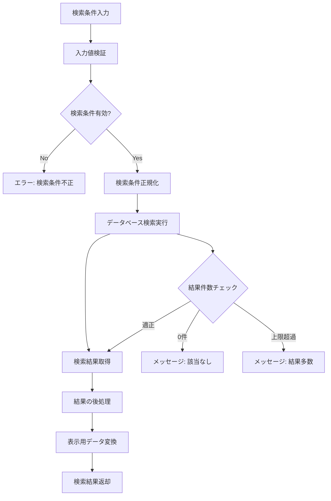

# 社員検索ロジック設計書

## 1. 概要

### 1.1 目的
受注入力フォームシステムにおける担当者検索機能の詳細なロジックを定義し、効率的で正確な担当者情報の検索・取得を実現する。

### 1.2 適用範囲
- REQ-F-002: 担当検索機能
- 社員マスタとの連携
- 受注入力フォームでの担当者自動入力
- 担当者情報の表示・選択

### 1.3 前提条件
- 社員マスタが適切に設定されている
- 社員には地区コード・所属コード・氏名・カナが登録されている
- 検索対象は有効な社員のみ

## 2. データ構造

### 2.1 社員マスタ構造（実データ基準）
```typescript
interface Employee {
  employee_id: string;         // 社員ID（UUID）
  district_code: string;       // 地区コード（511, 521, 531, 541, 561）
  department_code: string;     // 所属コード（数値文字列: "7", "124", "12", "42"等）
  department_name: string;     // 所属名（福岡支店、福岡西営業所等）
  full_name: string;          // 営業社員名（フルネーム）
  display_name: string;       // 転記用名前（苗字のみ）
  name_kana: string;          // 検索用カタカナ（全角、スペースなし）
  employee_type: 'regular' | 'se'; // 社員区分（通常 | SE）
  is_active: boolean;         // 有効フラグ
  created_at: Date;
  updated_at: Date;
}

// 地区コード体系
enum DistrictCode {
  KYUSHU = '511',    // 九州地区（福岡、熊本、大分、佐賀、長崎、鹿児島、宮崎）
  CHUGOKU = '521',   // 中国地区（広島、下関、小郡、徳山、岩国、岡山、倉敷、福山）
  SHIKOKU = '531',   // 四国地区（高松、徳島、松山、宇和島、高知、新居浜）
  KANSAI = '541',    // 関西地区（堺、北大阪、和歌山、姫路、明石、高槻、奈良南、京都、名古屋）
  KANTO = '561'      // 関東地区（川崎、埼玉、土浦、東京、富士）
}

// SE社員の特殊処理
interface SEEmployee extends Employee {
  se_identifier: string;      // SE識別子（"(SE)"付きの表示名）
  base_location: string;      // 配属地区名（佐賀、長崎、鹿児島等）
}
```

### 2.2 検索結果構造
```typescript
interface EmployeeSearchResult {
  employees: Employee[];
  total_count: number;
  has_more: boolean;
  search_criteria: EmployeeSearchCriteria;
  search_executed_at: Date;
}

interface EmployeeSearchCriteria {
  name_kana?: string;         // 担当者名（カナ）での検索
  district_code?: string;     // 地区コードでの検索
  department_code?: string;   // 所属コードでの検索
  full_name?: string;        // フルネームでの検索
  limit: number;             // 取得件数上限
  offset: number;            // オフセット
  sort_by: 'name_kana' | 'district_code' | 'department_code';
  sort_order: 'asc' | 'desc';
}
```

### 2.3 表示用社員情報
```typescript
interface EmployeeDisplayInfo {
  employee_id: string;
  full_name: string;          // "海江田 尊純"
  display_name: string;       // "海江田"（転記用）
  name_kana: string;          // "カイエダタカスミ"
  district_code: string;      // "511"
  department_code: string;    // "7"
  department_name: string;    // "福岡支店"
  district_name: string;      // "九州地区"
  employee_type: 'regular' | 'se';
  display_text: string;       // "海江田 尊純 (カイエダタカスミ) [511-7-福岡支店]"
  se_display_text?: string;   // SE社員の場合: "白濱(SE) (シラハマヨシハル) [佐賀営業所]"
}

// 実際のデータパターン例
interface RealDataExamples {
  regular_employee: {
    full_name: "海江田 尊純";
    display_name: "海江田";
    name_kana: "カイエダタカスミ";
    district_code: "511";
    department_code: "7";
    department_name: "福岡支店";
  };
  
  se_employee: {
    full_name: "白濱 義治";
    display_name: "白濱(SE)";
    name_kana: "シラハマヨシハル";
    district_code: "511";
    department_code: "佐賀";  // SE専用コード
    department_name: "佐賀営業所";
  };
  
  duplicate_name_handling: {
    // 同名の場合は所属で区別
    梅本智_42: "ウメモト42サトシ";    // 熊本支店の梅本
    梅本智_118: "ウメモト118サトシ";  // 天草営業所の梅本
    岩﨑拓哉_108: "イワサキ108タクヤ"; // 名古屋支店の岩﨑
    岩﨑拓哉_119: "イワサキ119タクヤ"; // 津営業所の岩﨑
  };
}
```

## 3. 検索ロジック

### 3.1 基本検索フロー


### 3.2 検索パターン

#### 3.2.1 担当者名（カナ）検索（実データ対応）
```typescript
function searchByNameKana(nameKana: string, options: SearchOptions): EmployeeSearchResult {
  // 入力値の正規化（全角カタカナ、スペースなし）
  const normalizedKana = normalizeKatakana(nameKana);
  
  // 前方一致優先検索（実データパターン対応）
  const query = `
    SELECT * FROM employees 
    WHERE is_active = true 
      AND name_kana LIKE ? 
    ORDER BY 
      CASE WHEN name_kana LIKE ? THEN 1 ELSE 2 END,  -- 前方一致を優先
      CASE 
        WHEN employee_type = 'regular' THEN 1 
        WHEN employee_type = 'se' THEN 2 
      END,  -- 通常社員を優先
      district_code ASC,
      department_code ASC,
      name_kana ASC
    LIMIT ? OFFSET ?
  `;
  
  const params = [
    `%${normalizedKana}%`,  // 部分一致用
    `${normalizedKana}%`,   // 前方一致判定用
    options.limit,
    options.offset
  ];
  
  return executeSearch(query, params);
}

// 実データ基準のカタカナ正規化関数
function normalizeKatakana(input: string): string {
  return input
    .replace(/\s+/g, '')  // スペース除去（実データはスペースなし）
    .replace(/[ひらがな]/g, (match) => {
      // ひらがなをカタカナに変換
      return String.fromCharCode(match.charCodeAt(0) + 0x60);
    })
    .replace(/[ａ-ｚＡ-Ｚ０-９]/g, (match) => {
      // 全角英数字を半角に変換
      return String.fromCharCode(match.charCodeAt(0) - 0xFEE0);
    })
    .toUpperCase()
    .replace(/[A-Z0-9]/g, (match) => {
      // 半角英数字を全角に変換（実データは全角カタカナ）
      return String.fromCharCode(match.charCodeAt(0) + 0xFEE0);
    });
}

// 同名社員の重複処理
function handleDuplicateNames(employees: Employee[]): Employee[] {
  const nameGroups = new Map<string, Employee[]>();
  
  // 同じ氏名でグループ化
  employees.forEach(emp => {
    const baseName = emp.full_name.replace(/\s+/g, '');
    if (!nameGroups.has(baseName)) {
      nameGroups.set(baseName, []);
    }
    nameGroups.get(baseName)!.push(emp);
  });
  
  // 同名の場合は所属情報を含むカナで区別
  nameGroups.forEach((group, name) => {
    if (group.length > 1) {
      group.forEach(emp => {
        // カタカナに所属識別子を追加
        if (!emp.name_kana.includes(emp.department_code)) {
          emp.name_kana = emp.name_kana + emp.department_code;
        }
      });
    }
  });
  
  return employees;
}
```

#### 3.2.2 所属コード検索（実データ対応）
```typescript
function searchByDepartmentCode(departmentCode: string, options: SearchOptions): EmployeeSearchResult {
  // 数値文字列での完全一致検索 + SE専用コード対応
  const query = `
    SELECT * FROM employees 
    WHERE is_active = true 
      AND (department_code = ? OR department_code = ?)
    ORDER BY 
      CASE WHEN employee_type = 'regular' THEN 1 ELSE 2 END,
      name_kana ASC
    LIMIT ? OFFSET ?
  `;
  
  // 通常の所属コードとSE専用コード（地区名）の両方で検索
  const params = [
    departmentCode, 
    departmentCode, // SE用の地区名コードも同じ値で検索
    options.limit, 
    options.offset
  ];
  
  return executeSearch(query, params);
}

// 実際の所属コード例
const DEPARTMENT_CODES = {
  // 九州地区 (511)
  FUKUOKA_BRANCH: '7',           // 福岡支店
  FUKUOKA_WEST: '124',          // 福岡西営業所
  KURUME: '12',                 // 久留米営業所
  KUMAMOTO_BRANCH: '42',        // 熊本支店
  TAMANA: '63',                 // 玉名営業所
  AMAKUSA: '118',               // 天草営業所
  KITAKYUSHU: '8',              // 北九州支店
  YUKUHASHI: '79',              // 行橋営業所
  // ... 他多数
  
  // SE専用コード
  SAGA_SE: '佐賀',              // 佐賀営業所SE
  NAGASAKI_SE: '長崎',          // 長崎支店SE
  KAGOSHIMA_SE: '鹿児島',       // 鹿児島支店SE
  // ... 他SE配属地区
};
```

#### 3.2.3 地区コード検索（実データ対応）
```typescript
function searchByDistrictCode(districtCode: string, options: SearchOptions): EmployeeSearchResult {
  // 3桁地区コードでの完全一致検索
  const query = `
    SELECT * FROM employees 
    WHERE is_active = true 
      AND district_code = ?
    ORDER BY 
      CAST(department_code AS INTEGER) ASC,  -- 所属コードを数値順でソート
      name_kana ASC
    LIMIT ? OFFSET ?
  `;
  
  const params = [districtCode, options.limit, options.offset];
  
  return executeSearch(query, params);
}

// 実際の地区コード体系
const DISTRICT_MAPPING = {
  '511': {
    name: '九州地区',
    prefectures: ['福岡', '熊本', '大分', '佐賀', '長崎', '鹿児島', '宮崎'],
    departments: [7, 124, 12, 42, 63, 118, 8, 79, 25, 101, 10, 26, 15, 24, 157, 4, 5, 6, 156, 23, 30, 46, 54, 98, 31, 47, 55]
  },
  '521': {
    name: '中国地区',
    prefectures: ['広島', '山口', '岡山'],
    departments: [20, 9, 19, 75, 11, 13, 17, 18, 16, 27, 65]
  },
  '531': {
    name: '四国地区',
    prefectures: ['香川', '徳島', '愛媛', '高知'],
    departments: [38, 49, 41, 67, 59, 39]
  },
  '541': {
    name: '関西地区',
    prefectures: ['大阪', '和歌山', '兵庫', '奈良', '京都', '愛知', '岐阜', '三重'],
    departments: [36, 34, 44, 21, 28, 35, 70, 103, 52, 108, 114, 115, 119]
  },
  '561': {
    name: '関東地区',
    prefectures: ['神奈川', '埼玉', '茨城', '東京', '静岡'],
    departments: [147, 128, 142, 162]
  }
};
```

#### 3.2.4 複合条件検索
```typescript
function searchByMultipleCriteria(criteria: EmployeeSearchCriteria): EmployeeSearchResult {
  const conditions: string[] = ['is_active = true'];
  const params: any[] = [];
  
  // 担当者名（カナ）条件
  if (criteria.name_kana) {
    const normalizedKana = normalizeKatakana(criteria.name_kana);
    conditions.push('name_kana LIKE ?');
    params.push(`%${normalizedKana}%`);
  }
  
  // 地区コード条件
  if (criteria.district_code) {
    conditions.push('district_code = ?');
    params.push(criteria.district_code);
  }
  
  // 所属コード条件
  if (criteria.department_code) {
    conditions.push('department_code = ?');
    params.push(criteria.department_code);
  }
  
  // ORDER BY句の構築
  let orderBy = 'name_kana ASC';
  if (criteria.sort_by) {
    orderBy = `${criteria.sort_by} ${criteria.sort_order || 'ASC'}`;
  }
  
  const query = `
    SELECT * FROM employees 
    WHERE ${conditions.join(' AND ')}
    ORDER BY ${orderBy}
    LIMIT ? OFFSET ?
  `;
  
  params.push(criteria.limit, criteria.offset);
  
  return executeSearch(query, params);
}
```

### 3.3 検索結果の後処理

#### 3.3.1 表示用データ変換（実データ対応）
```typescript
function convertToDisplayInfo(employee: Employee): EmployeeDisplayInfo {
  const district_name = getDistrictName(employee.district_code);
  
  // SE社員の特殊表示処理
  if (employee.employee_type === 'se') {
    const se_display_text = `${employee.display_name} (${employee.name_kana}) [${employee.department_name}]`;
    return {
      employee_id: employee.employee_id,
      full_name: employee.full_name,
      display_name: employee.display_name,
      name_kana: employee.name_kana,
      district_code: employee.district_code,
      department_code: employee.department_code,
      department_name: employee.department_name,
      district_name,
      employee_type: employee.employee_type,
      display_text: se_display_text,
      se_display_text
    };
  }
  
  // 通常社員の表示処理
  const display_text = `${employee.full_name} (${employee.name_kana}) [${employee.district_code}-${employee.department_code}-${employee.department_name}]`;
  
  return {
    employee_id: employee.employee_id,
    full_name: employee.full_name,
    display_name: employee.display_name,
    name_kana: employee.name_kana,
    district_code: employee.district_code,
    department_code: employee.department_code,
    department_name: employee.department_name,
    district_name,
    employee_type: employee.employee_type,
    display_text
  };
}

// 実データ基準の地区名取得
function getDistrictName(districtCode: string): string {
  const districtMap: Record<string, string> = {
    '511': '九州地区',
    '521': '中国地区', 
    '531': '四国地区',
    '541': '関西地区',
    '561': '関東地区'
  };
  return districtMap[districtCode] || '不明';
}

// 実データ基準の部署名マッピング（一部例）
function getDepartmentName(districtCode: string, departmentCode: string): string {
  const departmentMap: Record<string, Record<string, string>> = {
    '511': { // 九州地区
      '7': '福岡支店',
      '124': '福岡西営業所',
      '12': '久留米営業所',
      '42': '熊本支店',
      '63': '玉名営業所',
      '118': '天草営業所',
      '8': '北九州支店',
      '79': '行橋営業所',
      '25': '宗像営業所',
      '101': '八幡営業所',
      '10': '大分営業所',
      '26': '中津営業所',
      '15': '佐賀営業所',
      '24': '唐津営業所',
      '157': '武雄営業所',
      '4': '佐世保支店',
      '5': '長崎支店',
      '6': '諫早営業所',
      '156': '大村営業所',
      '23': '島原営業所',
      '30': '鹿児島支店',
      '46': '薩摩川内営業所',
      '54': '鹿屋営業所',
      '98': '出水営業所',
      '31': '宮崎営業所',
      '47': '都城営業所',
      '55': '日向営業所',
      // SE専用
      '佐賀': '佐賀営業所',
      '長崎': '長崎支店',
      '鹿児島': '鹿児島支店',
      '宮崎': '宮崎営業所'
    },
    '521': { // 中国地区
      '20': '広島支店',
      '9': '下関支店',
      '19': '小郡営業所',
      '75': '東広島営業所',
      '11': '徳山営業所',
      '13': '岩国営業所',
      '17': '岡山支店',
      '18': '倉敷営業所',
      '16': '福山営業所',
      '27': '三原営業所',
      '65': '松江営業所',
      // SE専用
      '岡山': '岡山支店'
    },
    // 他地区も同様...
  };
  
  return departmentMap[districtCode]?.[departmentCode] || '不明';
}
```

## 4. 検索パターン例

### 4.1 パターン1: カナ名前方一致検索（実データ例）
**検索条件**: "タナカ"

**検索結果**:
```
1. 田中 秀和 (タナカヒデカズ) [511-12-久留米営業所] - 前方一致のため上位表示
2. 田中 倫太郎 (タナカリンタロウ) [511-25-宗像営業所] - 前方一致のため上位表示
3. 田中 直文 (タナカナオフミ) [521-18-倉敷営業所] - 前方一致のため上位表示
4. 田邊 聡 (タナベサトシ) [511-鹿児島-鹿児島支店] - 部分一致のため下位表示（SE）
```

### 4.2 パターン2: 所属コード完全一致検索（実データ例）
**検索条件**: 所属コード "7"

**検索結果**:
```
1. 海江田 尊純 (カイエダタカスミ) [511-7-福岡支店]
2. 山本 健 (ヤマモトケン) [511-7-福岡支店]
3. 舛田 恭経 (マスダヤスノリ) [511-7-福岡支店]
4. 寺園 和義 (テラゾノカズヨシ) [511-7-福岡支店]
```

### 4.3 パターン3: 地区コード検索（実データ例）
**検索条件**: 地区コード "521" (中国地区)

**検索結果**:
```
1. 砂川 孝 (スナガワタカシ) [521-9-下関支店]
2. 二神 誠 (フタガミマコト) [521-9-下関支店]
3. 梶村 将吾 (カジムラショウゴ) [521-11-徳山営業所]
4. 綿重 仁 (ワタシゲヒトシ) [521-13-岩国営業所]
... (中国地区の全社員)
```

### 4.4 パターン4: SE社員検索
**検索条件**: "シラハマ"

**検索結果**:
```
1. 白濱(SE) (シラハマヨシハル) [佐賀営業所] - SE社員専用表示
```

### 4.5 パターン5: 同名社員の区別
**検索条件**: "ウメモト"

**検索結果**:
```
1. 梅本 智 (ウメモト42サトシ) [511-42-熊本支店] - 所属コード付きカナで区別
2. 梅本 智 (ウメモト118サトシ) [511-118-天草営業所] - 所属コード付きカナで区別
```

### 4.6 パターン6: 複合条件検索（実データ例）
**検索条件**: カナ "ヤマモト" + 地区コード "511"

**検索結果**:
```
1. 山本 健 (ヤマモトケン) [511-7-福岡支店]
2. 山本 竜太 (ヤマモトリュウタ) [511-5-長崎支店]
3. 山本 亮祐 (ヤマモトリョウスケ) [511-23-島原営業所]
4. 山本 晃久 (ヤマモトアキヒサ) [521-16-福山営業所] - 除外（地区コード不一致）
```

## 5. エラーハンドリング

### 5.1 エラーパターン
| エラーコード | エラー内容 | 対処法 |
|------------|-----------|--------|
| SEARCH_001 | 検索条件未入力 | 検索条件の入力 |
| SEARCH_002 | 検索条件が短すぎる | 2文字以上での検索 |
| SEARCH_003 | 検索結果が多すぎる | 条件を絞り込んで再検索 |
| SEARCH_004 | 検索結果なし | 条件を変更して再検索 |
| SEARCH_005 | データベース接続エラー | システム管理者への連絡 |
| SEARCH_006 | 不正な検索パラメータ | パラメータの確認・修正 |

### 5.2 エラーレスポンス形式
```typescript
interface SearchError {
  error_code: string;
  error_message: string;
  error_details?: {
    search_criteria?: EmployeeSearchCriteria;
    validation_failures?: string[];
  };
  suggested_actions: string[];
}
```

## 6. 業務ルール

### 6.1 検索の原則
1. **有効社員のみ検索**: is_active = true の社員のみ対象
2. **部分一致優先**: カナ検索では前方一致を上位表示
3. **結果件数制限**: 1回の検索で最大50件まで
4. **最小検索文字数**: カナ検索は2文字以上

### 6.2 表示ルール
1. **表示順序**: 前方一致 → 部分一致 → カナ昇順
2. **表示形式**: "姓 名 (カナ) [地区コード-所属コード]"
3. **重複排除**: 同一社員IDの重複を排除

### 6.3 パフォーマンス考慮
1. **インデックス活用**: name_kana, district_code, department_code にインデックス
2. **結果キャッシュ**: 同一検索条件の結果を一定時間キャッシュ
3. **ページング**: 大量結果時のページング対応

## 7. API仕様

### 7.1 社員検索API
```typescript
// エンドポイント
GET /api/employees/search

// クエリパラメータ
interface EmployeeSearchParams {
  name_kana?: string;         // 担当者名（カナ）
  district_code?: string;     // 地区コード
  department_code?: string;   // 所属コード
  limit?: number;            // 取得件数（デフォルト: 20, 最大: 50）
  offset?: number;           // オフセット（デフォルト: 0）
  sort_by?: 'name_kana' | 'district_code' | 'department_code';
  sort_order?: 'asc' | 'desc';
}

// レスポンス（成功時）
interface EmployeeSearchResponse {
  success: true;
  data: {
    employees: EmployeeDisplayInfo[];
    total_count: number;
    has_more: boolean;
    search_criteria: EmployeeSearchCriteria;
  };
}

// レスポンス（エラー時）
interface EmployeeSearchErrorResponse {
  success: false;
  error: SearchError;
}
```

### 7.2 社員詳細取得API
```typescript
// 特定社員の詳細情報取得
GET /api/employees/{employee_id}

interface EmployeeDetailResponse {
  success: true;
  data: Employee;
}
```

### 7.3 社員サジェストAPI
```typescript
// 入力補完用のサジェスト機能
GET /api/employees/suggest

interface SuggestParams {
  query: string;              // 検索クエリ（2文字以上）
  limit?: number;            // 候補数（デフォルト: 10）
}

interface SuggestResponse {
  success: true;
  data: {
    suggestions: Array<{
      employee_id: string;
      display_text: string;
      match_type: 'name_prefix' | 'name_partial' | 'code_match';
    }>;
  };
}
```

## 8. フロントエンド連携

### 8.1 検索UI仕様
```typescript
// 検索フォームの状態管理
interface SearchFormState {
  searchQuery: string;        // 検索クエリ
  searchType: 'name_kana' | 'department_code' | 'district_code';
  results: EmployeeDisplayInfo[];
  isLoading: boolean;
  error: string | null;
  hasMore: boolean;
}

// 検索実行関数
async function performSearch(
  query: string, 
  type: SearchType, 
  options: SearchOptions = {}
): Promise<EmployeeSearchResult> {
  try {
    setLoading(true);
    
    const params: EmployeeSearchParams = {
      limit: options.limit || 20,
      offset: options.offset || 0
    };
    
    // 検索タイプに応じてパラメータ設定
    switch (type) {
      case 'name_kana':
        params.name_kana = query;
        break;
      case 'department_code':
        params.department_code = query;
        break;
      case 'district_code':
        params.district_code = query;
        break;
    }
    
    const response = await fetch('/api/employees/search?' + new URLSearchParams(params));
    const result = await response.json();
    
    if (!result.success) {
      throw new Error(result.error.error_message);
    }
    
    return result.data;
  } catch (error) {
    setError(error.message);
    throw error;
  } finally {
    setLoading(false);
  }
}
```

### 8.2 オートコンプリート機能
```typescript
// リアルタイム検索（デバウンス付き）
function useEmployeeSearch(initialQuery: string = '') {
  const [query, setQuery] = useState(initialQuery);
  const [results, setResults] = useState<EmployeeDisplayInfo[]>([]);
  const [isLoading, setIsLoading] = useState(false);
  
  // デバウンス処理（300ms）
  const debouncedQuery = useDebounce(query, 300);
  
  useEffect(() => {
    if (debouncedQuery.length >= 2) {
      performSearch(debouncedQuery, 'name_kana')
        .then(result => setResults(result.employees))
        .catch(error => console.error('検索エラー:', error));
    } else {
      setResults([]);
    }
  }, [debouncedQuery]);
  
  return { query, setQuery, results, isLoading };
}
```

## 9. テストケース

### 9.1 正常系テストケース
| テストID | 検索条件 | 期待結果 |
|---------|---------|---------|
| TC_001 | カナ "タナカ" | 前方一致優先で結果表示 |
| TC_002 | 所属コード "A01" | 該当部署の全員表示 |
| TC_003 | 地区コード "01" | 該当地区の全員表示 |
| TC_004 | 複合条件 | AND条件で絞り込み |

### 9.2 異常系テストケース
| テストID | 入力条件 | 期待エラー |
|---------|---------|----------|
| TC_E001 | 空文字検索 | SEARCH_001 |
| TC_E002 | 1文字検索 | SEARCH_002 |
| TC_E003 | 存在しないコード | SEARCH_004 |
| TC_E004 | 不正パラメータ | SEARCH_006 |

## 10. パフォーマンス要件

### 10.1 応答時間目標
- 通常検索: 500ms以内
- サジェスト: 200ms以内
- 詳細取得: 100ms以内

### 10.2 最適化施策
- データベースインデックスの最適化
- 検索結果のキャッシュ（Redis）
- 不要なJOINの排除
- ページング処理の効率化

## 11. 運用・保守

### 11.1 社員マスタメンテナンス
- 新入社員の登録
- 異動に伴う所属コード・地区コードの更新
- 退職者の無効化（論理削除）

### 11.2 検索ログ
- 検索クエリとヒット件数の記録
- 検索パフォーマンスの監視
- 人気の検索キーワード分析

## 12. 変更履歴

| 版数 | 日付 | 変更内容 | 作成者 |
|------|------|----------|--------|
| 1.0 | 2025-08-07 | 初版作成 | システム設計者 |
| 2.0 | 2025-08-07 | 実社員データ分析結果を反映<br/>・地区コード体系を実データ基準に更新（511,521,531,541,561）<br/>・所属コードを数値文字列に変更<br/>・SE社員の特殊処理追加<br/>・同名社員の識別ロジック追加<br/>・実際の部署名マッピング追加<br/>・検索パターン例を実データで更新<br/>・カタカナ正規化を実データ仕様に調整 | システム設計者 |

---

**注意事項:**
- 本ロジックは要件定義書 REQ-F-002 に基づいて設計されています
- 実装時は最新の社員マスタ構造を確認してください
- 個人情報の取り扱いには十分注意してください
