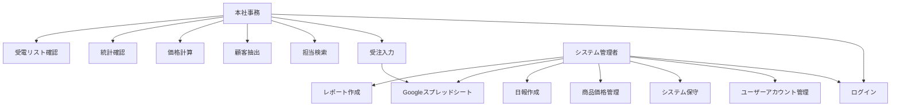

# 要件定義書

## 1. プロジェクト概要

### 1.1 プロジェクト名
受注入力フォームシステム（Order Entry Form System）

### 1.2 目的
営業活動における受注処理の効率化とデータ管理の一元化を図り、受注から契約完了までの業務フローを標準化・デジタル化することで、業務品質の向上と処理時間の短縮を実現する。

### 1.3 スコープ
**対象範囲:**
- 受注入力フォーム機能
- ダッシュボード機能（担当検索、顧客抽出、価格計算）
- 統計表示機能（受注件数、架電件数等）
- Googleスプレッドシート連携
- ユーザー認証・権限管理

**除外事項:**
- 既存基幹システムとの直接連携
- 請求書発行機能
- 在庫管理機能

### 1.4 ステークホルダー
- **プライマリユーザー**: 本社事務（15名）
- **システム管理者**: IT部門担当者（2名）
- **データ利用者**: 管理職・経営陣
- **開発チーム**: システム開発担当者

### 1.5 成功指標
- 受注入力時間の50%短縮
- データ入力エラーの80%削減
- 月次集計作業時間の70%削減
- ユーザー満足度80%以上

## 2. ターゲットユーザー・ペルソナ

### 2.1 ユーザー分類
- **主要ユーザー**: 本社事務（15名）
- **管理者**: システム管理者（2名）

### 2.2 ペルソナ定義
**本社事務（田中さん、35歳）**
- 1日10-20件の受注入力を行う
- PCスキル：中級レベル
- 社内のPCから業務を行う
- 効率的な入力と正確なデータ管理を重視

**システム管理者（佐藤さん、40歳）**
- システム設定・保守業務を担当
- 商品価格マスタの更新・管理
- 毎日の日報作成（地区別・時間帯別・特殊案件の集計）
- 月次集計作業（日報データを基にした月次レポート作成）
- レポートの配布・管理
- ユーザー管理・権限設定を実施

### 2.3 ユーザージャーニーマップ
1. システムログイン
2. 顧客情報の検索・確認
3. 受注情報の入力
4. 価格計算・確認
5. データ送信・保存
6. 統計情報の確認

### 2.4 利用環境
- **デバイス**: PC（Windows/Mac）
- **ブラウザ**: Chrome、Edge、Safari（最新版）
- **ネットワーク**: 社内LAN

## 3. 機能要件

### 3.1 機能要件一覧

| 機能ID | 機能名 | 優先度 |
|--------|--------|--------|
| REQ-F-001 | 受注入力フォーム | Must |
| REQ-F-002 | 担当検索機能 | Must |
| REQ-F-003 | 顧客抽出機能 | Should |
| REQ-F-004 | 価格計算機能 | Must |
| REQ-F-005 | 統計表示機能 | Should |
| REQ-F-006 | Googleスプレッドシート連携 | Must |
| REQ-F-007 | ユーザー認証機能 | Must |
| REQ-F-008 | 本日受電リスト表示 | Should |
| REQ-F-009 | 月次集計機能 | Must |
| REQ-F-010 | 日報作成機能 | Must |
| REQ-F-011 | トリガー管理機能 | Must |
| REQ-F-012 | 販売担当者管理機能 | Must |
| REQ-F-013 | 商品価格管理機能 | Must |
| REQ-F-014 | ユーザーアカウント管理機能 | Must |

### 3.2 機能要件詳細

#### REQ-F-001: 受注入力フォーム
- **概要**: 営業担当者が顧客からの受注情報を入力するメインフォーム
- **詳細仕様**:
  - 入力条件: ログイン済みユーザー
  - 処理内容: 
    - 受電受付日（mm/dd形式）
    - 挨拶時間
    - 販売担当者情報（名前、地区コード、所属コード）
    - 契約者情報（名前、年齢、性別、電話番号）
    - 確認者情報（挨拶日時、名前、続柄、電話番号）
    - 商品情報（商品名、数量、金額）
    - 工事情報（契約日、着工日、時間、完工日）
    - 支払情報、その他詳細項目
    - トリガー（特別処理フラグ）
  - 出力結果: 入力データの保存とGoogleスプレッドシートへの送信
  - 例外処理: 必須項目未入力時の警告表示
- **優先度**: Must
- **受入条件**: 全項目が正常に入力・保存され、Googleスプレッドシートに反映される
- **関連機能**: REQ-F-002, REQ-F-004, REQ-F-006

#### REQ-F-002: 担当検索機能（実データ対応）
- **概要**: 全国5地区・約300名の販売担当者情報を検索・取得する機能
- **詳細仕様**:
  - 入力条件: 担当者名(カナ)、所属コード、または地区コード
  - 処理内容: 
    - カナ検索：前方一致優先、部分一致対応
    - 所属コード検索：数値文字列での完全一致（SE専用コードも対応）
    - 地区コード検索：5地区（511:九州、521:中国、531:四国、541:関西、561:関東）での絞り込み
    - 同名社員の区別：所属コード付きカナでの識別
    - SE社員の特別表示：「(SE)」付き表示名での区別
  - 出力結果: 
    - 通常社員：「営業社員名 (検索用カナ) [地区コード-所属コード-所属名]」
    - SE社員：「転記用名前 (検索用カナ) [所属名]」
    - 転記用名前（苗字のみ）の自動入力
  - 例外処理: 該当者なしの場合の警告表示、検索条件の緩和提案
- **優先度**: Must
- **受入条件**: 実データ約300名の担当者情報が正確に検索・表示される
- **関連機能**: REQ-F-001

#### REQ-F-003: 顧客抽出機能
- **概要**: 他システムの画面コピーから顧客情報を抽出する機能
- **詳細仕様**:
  - 入力条件: 他システムの画面コピー（定型フォーマット）
  - 処理内容: コピーされたテキストから顧客情報を解析・抽出
  - 出力結果: 顧客No.、顧客名、電話番号、年齢の自動入力
  - 例外処理: フォーマット不正時の手動入力案内
- **優先度**: Should
- **受入条件**: 定型フォーマットから顧客情報が正確に抽出・表示される
- **関連機能**: REQ-F-001

#### REQ-F-004: 価格計算機能（高度な価格体系対応）
- **概要**: 複雑な価格体系に対応した自動計算機能
- **詳細仕様**:
  - 入力条件: 商品名、数量、高さ（基礎商品の場合）、長さ（基礎商品の場合）
  - 処理内容: 
    - 基本価格計算：基本数量以下は基本価格、超過分は基本超単価で計算
    - 条件付き割引計算：
      - カビ商品：消毒商品との組み合わせで1,000円/㎡、基礎商品との組み合わせで1,700円/㎡
      - BM商品：特定商品との組み合わせで2,800円（通常3,300円）
    - 基礎商品の高さ別価格：30cm〜80cmの6段階価格設定
    - 値引き計算：パーセント値引き（100未満）と固定金額値引き（100以上）
    - 複数商品管理：最大6商品（通常）+ 4商品（基礎）の同時計算
    - セット割引：外基礎・中基礎セット値引き40,000円
    - 一般管理費：20,000円の追加オプション
  - 出力結果: 
    - 商品別計算結果（税抜・税込）
    - 値引き表示付き商品名（例：「外基礎▲5%」）
    - 合計金額（商品合計 + 一般管理費 - セット割引）
    - 計算詳細の表示
  - UI/UX要件:
    - 価格計算UIは右側オフキャンバス（ドロワー）で開閉し、メイン画面の縦長化を防止
    - カテゴリ→商品名の連動セレクトを採用し、選択したカテゴリに紐づく商品名のみ表示
    - 商品選択時に単位を自動設定（例：㎡/m/個/式）
    - 「基礎関連」選択時のみ高さ(cm)/長さ(m)フィールドを自動表示
    - 選択商品は「バスケット（選択商品リスト）」に追加し、一覧で確認・削除可能
    - バスケットから中央フォームの「商品情報」へ反映できる
  - 例外処理: 商品未登録時の手動入力対応、計算エラー時の警告表示
- **優先度**: Must
- **受入条件**: 複雑な価格体系が正確に計算・表示される
- **関連機能**: REQ-F-001

#### REQ-F-005: 統計表示機能
- **概要**: 受注・架電件数等の統計情報表示
- **詳細仕様**:
  - 入力条件: ログイン済みユーザー
  - 処理内容: 日次・月次統計の集計・表示
  - 出力結果: 
    - 受注受付件数
    - 契約者架電件数
    - 確認者架電件数
  - 例外処理: データなしの場合の0件表示
- **優先度**: Should
- **受入条件**: 統計情報が正確に表示される
- **関連機能**: REQ-F-001

#### REQ-F-006: Googleスプレッドシート連携
- **概要**: 入力データのGoogleスプレッドシートへの自動送信
- **詳細仕様**:
  - 入力条件: 受注データ入力完了
  - 処理内容: Google Sheets APIを使用したデータ送信
  - 出力結果: スプレッドシートへのデータ追加
  - 例外処理: 送信失敗時の再送機能
- **優先度**: Must
- **受入条件**: データが正確にスプレッドシートに反映される
- **関連機能**: REQ-F-001

#### REQ-F-007: ユーザー認証機能
- **概要**: システムへのログイン・権限管理
- **詳細仕様**:
  - 入力条件: ユーザーID、パスワード
  - 処理内容: 認証処理とセッション管理
  - 出力結果: ログイン成功・失敗の判定
  - 例外処理: 認証失敗時のエラー表示
- **優先度**: Must
- **受入条件**: 15名のユーザーが正常にログインできる
- **関連機能**: 全機能

#### REQ-F-008: 本日受電リスト表示
- **概要**: 当日の受電一覧を表示する機能
- **詳細仕様**:
  - 入力条件: ログイン済みユーザー
  - 処理内容: 当日の受電データの取得・表示
  - 出力結果: 担当者、所属コード、顧客名の一覧
  - 例外処理: データなしの場合の空リスト表示
- **優先度**: Should
- **受入条件**: 当日の受電情報が正確に一覧表示される
- **関連機能**: REQ-F-001

#### REQ-F-009: 月次集計機能
- **概要**: システム管理者が実行する月次集計レポート作成機能
- **詳細仕様**:
  - 入力条件: システム管理者権限でログイン済み、対象年月の指定
  - 処理内容: 
    - 地区別受注件数の集計
    - 時間別受注件数の集計
    - 特殊案件の抽出・集計
    - 月次集計レポートの生成
  - 出力結果: 
    - 地区別集計表（地区コード、受注件数、売上金額）
    - 時間別集計表（時間帯、受注件数、構成比）
    - 特殊案件一覧（案件詳細、分類、件数）
    - 総合月次レポート（CSV/PDF形式）
  - 例外処理: データなしの場合の0件表示、集計エラー時の警告表示
- **優先度**: Must
- **受入条件**: 指定月の集計データが正確に算出され、レポートが出力される
- **関連機能**: REQ-F-001, REQ-F-007, REQ-F-010

#### REQ-F-010: 日報作成機能
- **概要**: システム管理者が毎日実行する日報作成機能
- **詳細仕様**:
  - 入力条件: システム管理者権限でログイン済み、対象日の指定
  - 処理内容: 
    - 当日の受注件数集計
    - 地区別受注件数の集計
    - 時間帯別受注件数の集計
    - 特殊案件の抽出・一覧表示
    - トリガー別案件数の集計
    - 日報レポートの生成
  - 出力結果: 
    - 日別受注件数サマリ（総件数、総売上金額）
    - 地区別日報（地区コード、件数、金額）
    - 時間帯別日報（時間帯、件数、構成比）
    - 特殊案件日報（案件一覧、種別分類）
    - トリガー別集計（トリガー種別、件数、処理状況）
    - 日報レポート（CSV/PDF形式）
  - 例外処理: データなしの場合の0件表示、集計エラー時の警告表示
- **優先度**: Must
- **受入条件**: 指定日の日報データが正確に集計され、レポートが出力される
- **関連機能**: REQ-F-001, REQ-F-007, REQ-F-009

#### REQ-F-011: トリガー管理機能
- **概要**: 特別な処理が必要な案件の状態管理と自動判定機能
- **詳細仕様**:
  - 入力条件: 受注データ入力時
  - 処理内容: 
    - 年齢チェック：契約者が70歳以上の場合、自動でトリガーを1に設定
    - 時間チェック：19時以降の対応の場合、自動でトリガーを5に設定
    - 手動設定：キャンセル（2）、チラシ未渡し（4）の手動選択
    - トリガー状態による表示切り替え
  - 出力結果: 
    - トリガー値の自動設定
    - トリガー状態に応じた警告表示
    - トリガー一覧の表示（フィルタリング機能）
  - 例外処理: トリガー値の手動修正、状態更新機能
- **優先度**: Must
- **受入条件**: 年齢・時間によるトリガーが自動設定され、状態管理が正確に行われる
- **関連機能**: REQ-F-001, REQ-F-010

#### REQ-F-012: 販売担当者管理機能
- **概要**: システム管理者による販売担当者情報の管理機能
- **詳細仕様**:
  - 入力条件: システム管理者権限
  - 処理内容:
    - 担当者情報CRUD: 新規登録・更新・削除・検索
    - 管理項目: 
      - 基本情報: 営業社員名、転記用名前、検索用カタカナ
      - 組織情報: 地区コード（511,521,531,541,561）、所属コード、所属名
      - 社員区分: 通常社員・SE社員の区別
      - 権限設定: アクセス権限レベルの管理
    - 一括処理: CSVインポート・エクスポート機能
    - データ検証: 重複チェック、必須項目チェック、同名社員の識別処理
  - 出力結果:
    - 担当者マスタの更新
    - 変更履歴の記録
    - 検索機能への即座反映
- **優先度**: Must
- **受入条件**: 約300名の担当者情報が正確に管理され、検索機能に反映される
- **関連機能**: REQ-F-002

#### REQ-F-013: 商品価格管理機能
- **概要**: システム管理者による商品価格マスタの管理機能
- **詳細仕様**:
  - 入力条件: システム管理者権限
  - 処理内容:
    - 商品情報CRUD: 新規登録・更新・削除・検索
    - 管理項目:
      - 基本情報: 商品名、区分、カテゴリ1・2
      - 価格設定: 基本価格、基本超単価、基本数量、数量単位、税率
      - 条件付き割引: 割引条件・割引価格の設定（カビ・BM商品等）
      - 基礎商品: 高さ別価格設定（30cm〜80cm）、基本長さ設定
      - 有効期間: 有効開始日・終了日の管理
    - 価格履歴: 価格変更履歴の記録・表示
    - 一括処理: CSVインポート・エクスポート機能
    - 計算テスト: 価格計算ロジックのテスト機能
  - 出力結果:
    - 商品価格マスタの更新
    - 価格変更履歴の記録
    - 価格計算機能への即座反映
- **優先度**: Must
- **受入条件**: 複雑な価格体系が正確に管理され、価格計算機能に反映される
- **関連機能**: REQ-F-004

#### REQ-F-014: ユーザーアカウント管理機能
- **概要**: システム管理者によるシステム利用者のアカウント管理機能
- **詳細仕様**:
  - 入力条件: システム管理者権限でログイン済み
  - 処理内容:
    - ユーザー情報CRUD: 新規登録・更新・削除・検索・一覧表示
    - 管理項目:
      - 基本情報: ユーザーID、氏名、メールアドレス、所属部署
      - 認証情報: パスワード（暗号化保存）、パスワード有効期限
      - 権限設定: 権限レベル（一般ユーザー/管理者）、アクセス可能機能の設定
      - アカウント状態: 有効/無効、ロック状態、最終ログイン日時
      - セキュリティ設定: パスワード変更強制、多要素認証設定
    - 一括処理: CSVインポート・エクスポート機能
    - パスワード管理: パスワードリセット、強制変更機能
    - アクセス制御: IP制限、時間制限の設定
    - 監査ログ: アカウント操作履歴の記録・表示
  - 出力結果:
    - ユーザーアカウントマスタの更新
    - 権限変更の即座反映
    - セキュリティ設定の適用
    - 操作履歴の記録
  - 例外処理: 重複ユーザーIDの警告、権限変更時の確認ダイアログ、削除時の関連データ確認
- **優先度**: Must
- **受入条件**: 15名のユーザーアカウントが正確に管理され、権限設定が正しく機能する
- **関連機能**: REQ-F-007

## 4. ユースケース

### 4.1 アクター定義
- **本社事務**: システムの主要利用者（受注入力業務）
- **システム管理者**: システム設定・商品価格管理・月次作業・ユーザー管理担当

### 4.2 ユースケース図

### 4.3 ユースケース詳細

#### UC-001: 受注入力
- **アクター**: 本社事務
- **事前条件**: システムにログイン済み
- **基本フロー**: 
  1. 受注入力フォームにアクセス
  2. 他システムから顧客情報をコピー・抽出または手動入力
  3. 担当者情報を検索・選択
  4. 商品情報を入力し価格計算実行
  5. 全項目入力後、データ保存
  6. Googleスプレッドシートに自動送信
- **代替フロー**: 入力エラー時の修正・再入力、顧客情報抽出失敗時の手動入力
- **事後条件**: 受注データが保存され、統計に反映される

#### UC-002: システム管理
- **アクター**: システム管理者
- **事前条件**: 管理者権限でログイン済み
- **基本フロー**: 
  1. 管理画面にアクセス
  2. 商品価格マスタの更新・管理
  3. ユーザー管理（追加・削除・権限変更）
  4. 日報作成作業の実行（毎日）
     - 対象日の指定
     - 地区別・時間帯別受注件数の集計
     - 特殊案件の抽出・一覧作成
     - 日報レポート生成・出力
  5. 月次集計作業の実行（月末）
     - 対象年月の指定
     - 日報データを基にした月次集計
     - 月次レポート生成・出力
  6. システム設定の変更・保守
- **代替フロー**: エラー発生時の復旧作業、集計データ不整合時の手動修正
- **事後条件**: システム設定・マスタデータが更新され、日報・月次レポートが作成される

#### UC-003: 日報作成
- **アクター**: システム管理者
- **事前条件**: 管理者権限でログイン済み、対象日の受注データが存在
- **基本フロー**: 
  1. 日報作成画面にアクセス
  2. 対象日の選択（デフォルト：前日）
  3. 日別集計データの自動生成
     - 総受注件数・売上金額の算出
     - 地区別受注件数の集計
     - 時間帯別受注件数の集計
     - 特殊案件の抽出・分類
  4. 日報データの確認・修正
  5. 日報レポートの生成・保存
- **代替フロー**: データ不整合時の手動修正、特殊案件の手動分類
- **事後条件**: 指定日の日報データが保存され、月次集計の基礎データとして利用可能

#### UC-004: ユーザーアカウント管理
- **アクター**: システム管理者
- **事前条件**: 管理者権限でログイン済み
- **基本フロー**: 
  1. ユーザー管理画面にアクセス
  2. ユーザー一覧の表示・検索
  3. 新規ユーザー登録
     - 基本情報の入力（ユーザーID、氏名、メールアドレス、所属部署）
     - 初期パスワードの設定
     - 権限レベルの設定（一般ユーザー/管理者）
     - アカウント状態の設定（有効/無効）
  4. 既存ユーザー情報の更新
     - 基本情報の変更
     - 権限レベルの変更
     - パスワードリセット・強制変更
     - アカウント状態の変更（有効/無効、ロック/アンロック）
  5. セキュリティ設定の管理
     - パスワード有効期限の設定
     - 多要素認証の設定
     - IP制限・時間制限の設定
  6. 監査ログの確認
     - アカウント操作履歴の表示
     - ログイン履歴の確認
- **代替フロー**: 
  - 重複ユーザーID入力時の警告表示
  - 権限変更時の確認ダイアログ表示
  - 削除時の関連データ確認
  - パスワード強度不足時の警告表示
- **事後条件**: ユーザーアカウント情報が正確に更新され、権限設定が正しく適用される

## 5. 非機能要件

### 5.1 パフォーマンス要件
- **レスポンス時間**: 通常操作は3秒以内
- **スループット**: 同時ユーザー数15名
- **データ処理**: 1日最大300件の受注入力に対応

### 5.2 可用性要件
- **稼働率**: 営業時間中99.5%以上
- **障害復旧時間**: 4時間以内
- **バックアップ**: 日次バックアップ実施

### 5.3 セキュリティ要件
- **認証**: ユーザーID/パスワード認証
- **データ暗号化**: 通信時のHTTPS暗号化
- **アクセス制御**: ユーザー権限に応じた機能制限
- **監査ログ**: ログイン・データ更新履歴の記録

### 5.4 ユーザビリティ要件
- **操作性**: 直感的なUI設計
- **PC対応**: デスクトップブラウザ最適化
- **入力支援**: 自動補完・入力チェック機能・コピー貼り付け対応
 - **価格計算UI**: オフキャンバスによる開閉式レイアウトを採用し、メイン画面の縦長化を回避
 - **選択操作**: カテゴリ→商品名の連動セレクト、頻出商品の高速選択（将来拡張）
 - **視認性**: 計算結果（税抜/税込）を即時表示、必要時のみ詳細を展開

### 5.5 拡張性・保守性要件
- **スケーラビリティ**: ユーザー数50名まで拡張可能
- **保守性**: モジュール化された設計
- **データ移行**: 既存データの取り込み機能

## 6. 制約条件

### 6.1 技術制約
- **開発言語**: JavaScript/TypeScript（フロントエンド）、Node.js（バックエンド）
- **データベース**: PostgreSQL または MySQL
- **外部連携**: Google Sheets API使用必須

### 6.2 運用制約
- **運用時間**: 平日8:00-20:00
- **保守時間**: 土日祝日のメンテナンス実施
- **バックアップ**: 毎日深夜に自動実行

### 6.3 法的制約
- **個人情報保護**: 個人情報保護法への準拠
- **データ保持**: 3年間のデータ保管義務

### 6.4 予算・スケジュール制約
- **開発期間**: 3ヶ月以内
- **予算**: 要調整

### 6.5 組織制約
- **開発体制**: 開発者2-3名
- **承認プロセス**: 各フェーズでの承認必要

## 7. データ要件

### 7.1 データエンティティ
1. **社員マスタ（実データ基準）**
   - 社員ID、地区コード（511,521,531,541,561）、所属コード（数値文字列）、所属名、営業社員名（フルネーム）、転記用名前（苗字のみ）、検索用カタカナ（全角、スペースなし）、社員区分（通常/SE）、権限レベル

2. **商品価格マスタ（拡張仕様）**
   - 商品ID、区分、カテゴリ1、カテゴリ2、商品名、基本価格、基本超単価、基本数量、数量単位、税率、条件付き割引設定、高さ別価格設定（基礎商品用）、更新者、作成日、更新日

3. **顧客マスタ**
   - 顧客ID、顧客No.、氏名、年齢、性別、電話番号、住所

4. **受注データ**
   - 受注ID、受電受付日、販売担当者、顧客情報、商品情報、工事情報等

5. **ユーザー情報**
   - ユーザーID、パスワード、権限、最終ログイン日時、作成日、更新日、アカウント状態、セキュリティ設定

6. **月次集計データ**
   - 集計ID、対象年月、受注件数、売上金額、担当者別集計、地区別集計、時間別集計、特殊案件集計、作成日、作成者

7. **日報データ**
   - 日報ID、対象日、日別受注件数、日別売上金額、地区別日報、時間帯別日報、特殊案件日報、トリガー別集計、作成日、作成者

### 7.2 データ属性
**社員マスタの詳細属性（実データ基準）:**
- 社員ID（UUID）
- 地区コード（VARCHAR(3)）：511,521,531,541,561
- 所属コード（VARCHAR(10)）：数値文字列またはSE専用地区名
- 所属名（VARCHAR(50)）：「福岡支店」「福岡西営業所」等
- 営業社員名（VARCHAR(50)）：フルネーム
- 転記用名前（VARCHAR(30)）：苗字のみ
- 検索用カタカナ（VARCHAR(50)）：全角、スペースなし
- 社員区分（ENUM）：'regular', 'se'

**商品価格マスタの詳細属性（拡張仕様）:**
- 商品ID（UUID）
- 区分（VARCHAR(20)）
- カテゴリ1（VARCHAR(30)）：「消毒」「床下機器」「基礎関連」等
- カテゴリ2（VARCHAR(30)）：詳細分類
- 商品名（VARCHAR(100)）
- 基本価格（DECIMAL(10,2)）
- 基本超単価（DECIMAL(10,2)）
- 基本数量（INT）
- 数量単位（VARCHAR(10)）：「㎡」「m」「個」「式」
- 税率（DECIMAL(3,2)）
- 条件付き割引設定（JSON）
- 高さ別価格設定（JSON）：基礎商品用

**受注データの詳細属性:**
- 受電受付日（DATE）
- 挨拶時間（TIME）
- 販売担当者名（VARCHAR(50)）：転記用名前を使用
- 販売担当者地区コード（VARCHAR(3)）：511,521,531,541,561
- 販売担当者所属コード（VARCHAR(10)）
- 契約者名（VARCHAR(50)）
- 契約者年齢（INT）
- 契約者性別（ENUM）
- 契約者固定電話（VARCHAR(15)）
- 契約者携帯番号（VARCHAR(15)）
- 確認者挨拶日時（DATETIME）
- 確認者名（VARCHAR(50)）
- 確認者続柄（ENUM）
- 確認者電話番号（VARCHAR(15)）
- 商品名（VARCHAR(100)）
- 数量（INT）
- 金額税抜（DECIMAL(10,2)）
- 契約日（DATE）
- 着工日（DATE）
- 時間（ENUM）
- 完工日（DATE）
- 支払い方法（ENUM）
- 受電受付者（VARCHAR(50)）
- チラシ（ENUM）
- 見積No（VARCHAR(20)）
- 備考（TEXT）
- 他社（ENUM）
- 履歴（ENUM）
- 今回（ENUM）
- 過量履歴総計（DECIMAL(10,2)）
- トリガー（INT）

**ユーザー情報の詳細属性:**
- ユーザーID（VARCHAR(50)）：一意の識別子
- 氏名（VARCHAR(100)）：フルネーム
- メールアドレス（VARCHAR(255)）：ログインIDとして使用
- 所属部署（VARCHAR(100)）：所属部署名
- パスワード（VARCHAR(255)）：暗号化されたパスワードハッシュ
- パスワード有効期限（DATE）：パスワードの有効期限
- 権限レベル（ENUM）：'user', 'admin'（一般ユーザー/管理者）
- アカウント状態（ENUM）：'active', 'inactive', 'locked'（有効/無効/ロック）
- 最終ログイン日時（DATETIME）：最後にログインした日時
- ログイン失敗回数（INT）：パスワード認証失敗回数
- アカウントロック日時（DATETIME）：アカウントがロックされた日時
- セキュリティ設定（JSON）：
  - パスワード変更強制フラグ（BOOLEAN）
  - 多要素認証設定（BOOLEAN）
  - IP制限設定（ARRAY）
  - 時間制限設定（JSON）
- 作成日（DATETIME）：アカウント作成日時
- 更新日（DATETIME）：最終更新日時
- 作成者（VARCHAR(50)）：アカウント作成者
- 更新者（VARCHAR(50)）：最終更新者

### 7.3 データ関係
- 社員マスタ ←→ 受注データ（1:多）
- 商品価格マスタ ←→ 受注データ（1:多）
- 顧客マスタ ←→ 受注データ（1:多）
- ユーザー情報 ←→ 受注データ（1:多）：受注入力者の記録
- ユーザー情報 ←→ 日報データ（1:多）：日報作成者の記録
- ユーザー情報 ←→ 月次集計データ（1:多）：集計作成者の記録

### 7.4 データ品質
- **精度**: 必須項目の入力チェック
- **完全性**: データ欠損の防止
- **一貫性**: マスタデータとの整合性確保

### 7.5 データライフサイクル
- **作成**: 受注入力時
- **更新**: 修正・変更時
- **削除**: 3年経過後のアーカイブ
- **バックアップ**: 日次自動実行

## 8. 競合・類似システム分析

### 8.1 競合システム調査
- **Salesforce**: 高機能だが高コスト
- **kintone**: 柔軟なカスタマイズ性
- **Zoho CRM**: 中小企業向け

### 8.2 機能比較
| 機能 | 本システム | Salesforce | kintone |
|------|------------|------------|---------|
| 受注入力 | ○ | ○ | ○ |
| Google連携 | ○ | △ | ○ |
| 価格計算 | ○ | ○ | ○ |
| コスト | 低 | 高 | 中 |

### 8.3 差別化ポイント
- 業界特化の入力項目設計
- Googleスプレッドシート直接連携
- シンプルで使いやすいUI

## 9. リスク分析

### 9.1 技術的リスク
- **Google API制限**: API利用制限による機能停止リスク
- **データ移行**: 既存データの移行時の品質リスク

### 9.2 ビジネスリスク
- **ユーザー受容**: 新システムへの抵抗リスク
- **運用変更**: 業務フローの変更に伴う混乱リスク

### 9.3 スケジュールリスク
- **開発遅延**: 要件変更による開発期間延長リスク
- **テスト期間**: 十分なテスト期間確保の困難性

### 9.4 リスク対策
- 段階的リリースによる影響最小化
- 十分な研修・サポート体制の構築
- バックアップシステムの準備

## 10. 用語集

| 用語 | 定義 |
|------|------|
| 受電受付日 | 販売担当からの電話を受けた日付 |
| 挨拶時間 | 本社事務が顧客に架電した時間 |
| 地区コード | 営業地域を示す識別コード |
| 所属コード | 営業担当者の所属部署コード |
| 確認者 | 契約内容を確認する顧客側の親族 |
| 過量履歴総計 | 他社・履歴・今回の3項目の合計値 |
| トリガー | 特別な処理が必要な案件の状態管理フラグ（1:確認者対応中、2:キャンセル、4:チラシ未渡し、5:時間外対応、空欄:完全受注） |

## 11. 付録

### 11.1 参考資料
- 既存業務フロー資料
- 類似システム調査資料

### 11.2 変更履歴
| 版数 | 日付 | 変更内容 | 作成者 |
|------|------|----------|--------|
| 1.0 | 2025-08-07 | 初版作成 | システム開発担当 |
| 1.1 | 2025-08-07 | ユーザー分類・機能要件の修正 | システム開発担当 |
| 2.0 | 2025-08-07 | 実データ分析結果を反映 ・社員マスタ構造を実データ基準に更新（5地区制、約300名対応） ・担当検索機能の詳細仕様更新（SE社員対応、同名社員区別） ・価格計算機能の高度化（条件付き割引、基礎商品、セット割引対応） ・商品価格マスタの拡張（条件付き割引、高さ別価格設定） ・データ属性の実データ準拠更新 | システム開発担当 |
| 2.1 | 2025-08-07 | 管理者機能の追加 ・REQ-F-012: 販売担当者管理機能追加 ・REQ-F-013: 商品価格管理機能追加 ・システム管理者の権限と責任の明確化 | システム開発担当 |
| 2.2 | 2025-08-08 | ユーザーアカウント管理機能の追加 ・REQ-F-014: ユーザーアカウント管理機能追加 ・UC-004: ユーザーアカウント管理ユースケース追加 ・ユーザー情報の詳細属性定義追加 ・データ関係にユーザー情報の関連性追加 | システム開発担当 |
| 2.3 | 2025-08-08 | 価格計算UIの改善を反映 ・REQ-F-004にUI/UX要件を追記（オフキャンバス化、カテゴリ→商品名の連動、単位自動設定、基礎項目の自動表示、バスケット連携） ・ユーザビリティ要件に価格計算UIの開閉式レイアウトを追記 | システム開発担当 |
