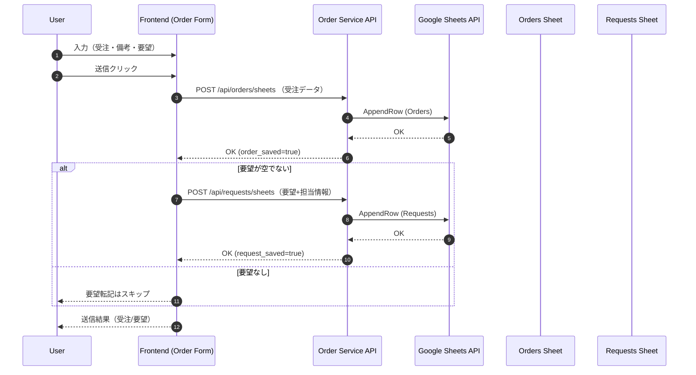

# 機能詳細設計書

| 版数 | 日付 | 作成者 | 変更内容 |
|------|------|--------|----------|
| 1.0 | 2025-08-09 | システム設計担当 | 初版作成（受注＋要望転記対応、価格計算UI変更反映） |

## 0. 設計前情報確認（要約）
- 参照: `docs/要件定義.md` v2.4（REQ-F-015 要望転記機能を含む）
- 参照: `docs/システムアーキテクチャ設計書.md` v1.2（Orders/Requests の2系統Sheets連携）
- 技術前提: フロントエンド（BootstrapベースのWeb UI）、バックエンド（Node.js/Express想定）、Google Sheets API 連携

## 1. 機能概要・設計前提
- 対象機能
  - REQ-F-001 受注入力フォーム（備考とは別の「要望」欄を追加）
  - REQ-F-004 価格計算（オフキャンバス化、カテゴリ→商品名連動、基礎項目の条件表示）
  - REQ-F-006 Googleスプレッドシート連携（受注シート／要望シートの2系統転記）
  - REQ-F-015 要望転記機能（要望が空でない場合のみ別シートへ転記）
- 非機能（抜粋）
  - レスポンス3秒目標／同時15ユーザー
  - HTTPS、認証、監査ログ

## 2. 画面・UI詳細
### 2.1 受注入力フォーム（`prototype/index.html`）
- 追加項目
  - 要望（`#request_text`、備考とは別、任意、最大1000文字想定）
- 価格計算UI（オフキャンバス）
  - カテゴリ→商品名の連動セレクト（単位自動設定）
  - 「基礎関連」選択時のみ 高さ/長さの入力表示
  - バスケット（選択商品）一覧と中央フォームへの反映

### 2.2 入力バリデーション
- 必須: 受電受付日、販売担当者（転記用名前）、商品名、数量
- 要望: 1000文字超過時はエラー表示
- 数値: 数量は1以上の整数、金額フィールドは数値のみ

## 3. 処理フロー設計
### 3.1 受注送信（要望分岐あり）


### 3.2 価格計算（抜粋）
- カテゴリ・商品・数量・（基礎は高さ/長さ）・値引きを元に即時計算し、税抜/税込を表示

## 4. データフロー設計（転記仕様）
### 4.1 Orders Sheet 転記項目（例）
- 転記列（推奨順）
  1. 送信日時（ISO）
  2. 受電受付日
  3. 挨拶時間
  4. 販売担当（転記用名前：苗字）
  5. 地区コード（担当）
  6. 所属コード（担当）
  7. 契約者名
  8. 契約者年齢
  9. 契約者電話（固定）
  10. 契約者電話（携帯）
  11. 商品名
  12. 数量
  13. 単位
  14. 金額（税抜）
  15. 契約日
  16. 着工日
  17. 時間（午前/午後/夜間）
  18. 完工日
  19. 支払い方法
  20. 受電受付者
  21. チラシ
  22. 見積No
  23. 他社
  24. 履歴
  25. 今回
  26. 過量履歴総計
  27. トリガー
  28. 備考

### 4.2 Requests Sheet 転記項目（必須）
- 転記列（固定）
  1. 送信日時（ISO）
  2. 地区コード（担当）
  3. 所属コード（担当）
  4. 転記用名前（苗字のみ）
  5. 要望内容（テキスト）

## 5. モジュール・コンポーネント設計
### 5.1 フロントエンド
- OrderFormController（送信ハンドラ）
  - 受注本体送信 → レスポンス確認
  - 要望欄が空でない場合：要望送信
  - 成功/失敗メッセージ表示、再送トリガ管理
- PriceDrawerController（オフキャンバス）
  - カテゴリ→商品名の連動制御、単位自動設定
  - 基礎関連時のオプション表示制御
  - バスケット管理・フォーム反映

### 5.2 バックエンド（API、Node.js/Express想定）
- Controllers
  - POST `/api/orders/sheets`: Orders Sheet へ追記
  - POST `/api/requests/sheets`: Requests Sheet へ追記
- Services
  - GoogleSheetsService.appendRow(sheetId, range, values)
  - RetryPolicy（指数バックオフ、最大3回）
- Config
  - 環境変数: SHEETS_CREDENTIALS、SHEET_ID_ORDERS、SHEET_ID_REQUESTS

## 6. インターフェース設計（API）
### 6.1 POST /api/orders/sheets
- Request (application/json)
```json
{
  "order": {
    "reception_date": "2025-08-09",
    "greeting_time": "10:30",
    "customer_name": "山田太郎",
    "customer_age": 75,
    "phone_fixed": "092-xxxx-xxxx",
    "phone_mobile": "090-xxxx-xxxx",
    "product_name": "外基礎",
    "quantity": 25,
    "unit": "m",
    "amount_ex_tax": 546250,
    "contract_date": "2025-08-20",
    "start_date": "2025-08-25",
    "time_slot": "午前",
    "end_date": "2025-08-30",
    "payment_method": "振込",
    "reception_staff": "本社事務 田中",
    "flyer": "新聞",
    "estimate_no": "EST-001",
    "other_company": 0,
    "history": 0,
    "current": 0,
    "total_history": 0,
    "trigger": 1,
    "remarks": "—"
  },
  "staff": {
    "display_name": "田中",
    "district_code": "511",
    "department_code": "7"
  }
}
```
- Response
```json
{ "success": true, "row": 123 }
```

### 6.2 POST /api/requests/sheets
- Request (application/json)
```json
{
  "request_text": "工期短縮の希望あり。",
  "staff": {
    "display_name": "田中",
    "district_code": "511",
    "department_code": "7"
  },
  "created_at": "2025-08-09T17:15:24Z"
}
```
- Response
```json
{ "success": true, "row": 45 }
```

## 7. エラーハンドリング設計
- 入力エラー: 必須未入力、要望1000文字超 → 400
- 外部APIエラー（Sheets）: リトライ（指数バックオフ：0.5s,1s,2s）
- 分岐方針
  - Orders送信成功・Requests送信失敗: 受注は成功扱い。要望は再送キュー（監査ログ記録・ユーザーに再送案内）
  - Orders送信失敗: 全体失敗、ユーザーへ再送案内

## 8. セキュリティ・性能設計（抜粋）
- セキュリティ: HTTPS、JWT認証、入力サニタイズ、レート制限
- 監査: 送信イベント（誰が・いつ・どの行に）を構造化ログで記録
- 性能: クライアント側デバウンス送信、Sheets API バッチ化（将来）

## 9. テスト設計（主要ケース）
- 受注のみ: 要望空欄 → Ordersのみ追記
- 受注＋要望: 要望あり → OrdersとRequests双方追記
- 要望長文: 1000文字超 → バリデーションエラー
- 失敗系: Orders成功/Requests失敗 → 再送キュー登録
- 価格計算: 基礎関連の高さ/長さ条件、値引き%/固定の両方

## 10. 実装ガイドライン
- 環境変数でシートID・認証情報を管理
- 行追加は列順固定で実装し、列追加時はマイグレーション手順を定義
- UIはアクセシビリティ配慮（ラベル/aria属性）

---

### 付録A. シート列定義（初期案）
- Orders Sheet: `timestamp, reception_date, greeting_time, staff_display_name, staff_district_code, staff_department_code, customer_name, customer_age, phone_fixed, phone_mobile, product_name, quantity, unit, amount_ex_tax, contract_date, start_date, time_slot, end_date, payment_method, reception_staff, flyer, estimate_no, other_company, history, current, total_history, trigger, remarks`
- Requests Sheet: `timestamp, staff_district_code, staff_department_code, staff_display_name, request_text`

### 付録B. 用語
- 転記用名前: 苗字のみ
- 要望: 備考とは別に記録し別シートへ転記する自由記述

### 付録C. 運用手順（再送・監査確認）
- 監査ログ出力先: `server/logs/audit.log`（JSON Lines）
  - 行例: `{ "time": "2025-08-09T10:15:00.000Z", "action": "orders.append", "payload": { ... }, "result": { "ok": true } }`
- 転記失敗時の再送手順:
  1. ユーザー画面に表示されるエラー内容を控える（HTTPコード/メッセージ）
  2. `audit.log` で該当時刻・アクション（`orders.append`/`requests.append`）を検索し、`result.ok=false` の詳細（`details`）を確認
  3. 一時的エラー（429/5xx）の場合は数分後に画面から再送（フロントは冪等：Sheets 追記は時刻キーで重複が低リスク）
  4. 恒久的エラー（認証・列不一致等）の場合は設定修正後に再送
  5. 必要に応じて、同一内容のJSONをバックエンドへ再投函（将来の運用APIを準備予定）
- レート制限に当たった場合:
  - レスポンス `429 RATE_LIMITED`。`X-RateLimit-*` ヘッダで残数/リセット秒を確認し、リセット後に再試行
- バックアップ: `server/data/*.json`（ユーザー等）と `server/logs/audit.log` を日次ローテーション対象に追加（将来）
